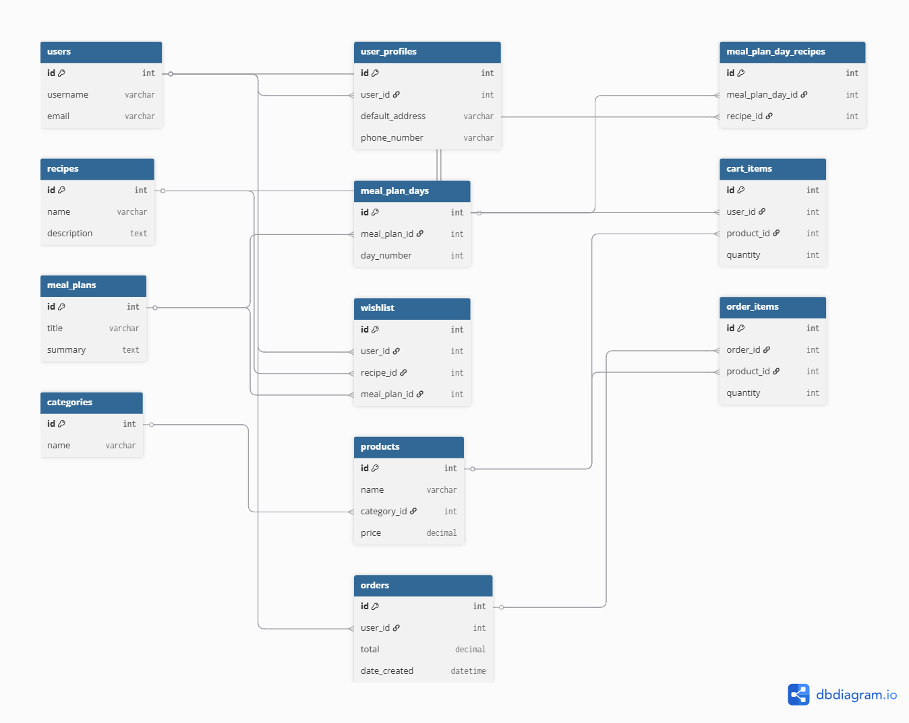

# Milestone-Project-4

# 📚 Table of Contents

- [📖 About](#📖-about)
  - [ Project Overview](#project-overview)
  - [ Site Purpose](#site-purpose)
  - [🎯 Target Audience](#🎯-target-audience)
- [ User Experience (UX)](#user-experience-ux)
  - [✅ User Stories](#✅-user-stories)
  - [🎨 Design Choices](#🎨-design-choices)
    - [ Colour Palette](#colour-palette)
    - [ Typography](#typography)
    - [ Icons](#icons)
    - [ Animations and Interactivity](#animations-and-interactivity)
    - [ Responsive Design](#responsive-design)
  - [🧾 Wireframes](#🧾-wireframes)
- [💡 Features](#💡-features)
  - [ Navigation Bar](#navigation-bar)
  - [ Homepage](#homepage)
  - [ Authentication (Login / Signup)](#authentication-login--signup)
  - [ Recipe CRUD (Create, Read, Update, Delete)](#recipe-crud-create-read-update-delete)
  - [ Meal Plan Pages](#meal-plan-pages)
  - [ Product Catalog & Shop](#product-catalog--shop)
  - [ Cart & Checkout](#cart--checkout)
  - [ Orders & Order History](#orders--order-history)
  - [💚 Wishlist System](#💚-wishlist-system)
  - [ User Profiles & Dashboard](#👤-user-profiles--dashboard)
  - [ Admin Features](#admin-features)
  - [ Contact Page](#contact-page)
- [🖥️ Technologies Used](#🖥️-technologies-used)
  - [ Languages and Frameworks](#languages-and-frameworks)
  - [ Libraries and Packages](#libraries-and-packages)
  - [ Development Tools](#development-tools)
- [📐 Code Quality](#📐-code-quality)
- [ Database](#database)
  - [ Model Relationships](#model-relationships)
  - [ Schema Diagram](#schema-diagram)
- [🧪 Testing](#🧪-testing)
- [🔐 Security](#🔐-security)
- [🚀 Deployment](#🚀-deployment)
  - [ Deployment](#deployment-process)
  - [ Cloning and Running Locally](#cloning-and-running-locally)
- [🔧 Future Improvements](#🔧-future-improvements)
- [📚 Credits](#📚-credits)
  - [ Resources and Tutorials](#-resources-and-tutorials)
  - [🙏 Inspiration and Acknowledgements](#-inspiration-and-acknowledgements)


## 📖 About

**Project Name**: FitZone Pro  
**Developer**: Danut Grigore  
**Type**: Milestone 4 – Full Stack Web Development (Code Institute)

FitZone Pro is a wellness-focused full-stack web application that allows users to discover meal plans, track recipes, shop fitness products, and manage their personal dashboard — all in one integrated platform.

Built using Django, PostgreSQL, and Bootstrap, it offers a responsive and professional user experience on any device.

---

###  Project Overview

FitZone Pro enables users to:

- 🥗 Explore curated meal plans tailored to different goals (e.g., weight loss, vegan, high-protein)
- 📖 View and manage healthy recipes, including adding their own
- 🛒 Shop for workout equipment, supplements, and clothing
- 👤 Save favorite items and track recent activity via a dashboard
- 🔐 Manage account information, including updating passwords and delivery preferences

Admins can add/edit products, review orders, and moderate recipe content via elevated permissions.

FitZone Pro is built to replicate real-world full-stack project challenges, including:

- User authentication & profile control
- CRUD operations across multiple models
- Stripe integration for e-commerce
- Clean, responsive frontend with custom styling
- Modular Django app structure

---

###  Site Purpose

The purpose of this project is to combine the most common tools used by fitness-focused users into one seamless digital experience. Unlike isolated meal plan apps or static recipe sites, FitZone Pro is designed to be:

-  Goal-oriented
-  Easy to use and mobile-friendly
-  Highly interactive for logged-in users
-  Commercially capable through its integrated shop

The platform supports both anonymous browsing and rich personalized features for registered users. It encourages healthy habits while offering flexibility and control.

**Key Features Include:**

-  Personalized user dashboard with saved content
-  Meal plan and recipe CRUD functionality
-  Product catalog with cart and secure checkout
-  Order tracking and past order display
-  Feedback via toasts and validation
-  Secure profile & password management

---

### 🎯 Target Audience

FitZone Pro is designed for the following user groups:

- 🧍‍♂️ **Health-conscious individuals** who want to follow structured meal plans and track progress
-  **Home cooks and food enthusiasts** looking to discover or save healthy recipes
-  **Fitness lovers** interested in buying quality supplements, gym gear, or workout apparel
-  **Registered users** who want to personalize their wellness experience, save content, and manage their data securely
-  **Shoppers** who want a convenient, all-in-one platform for browsing and purchasing fitness products
-  **Admin users** responsible for managing content, monitoring orders, and maintaining site integrity

---

## User Experience UX

### ✅ User Stories

The following user stories were considered during the design and development of FitZone Pro:

#### 🧍 Guest User
- As a visitor, I want to explore the website without creating an account.
- As a visitor, I want to browse meal plans and recipes to decide if the platform suits me.
- As a visitor, I want to view and search by keyword available products before deciding to sign up.

#### 👤 Registered User
- As a user, I want to register and log in securely.
- As a user, I want to view and save my favorite recipes and meal plans.
- As a user, I want to manage my profile information and change my password.
- As a user, I want to add items to my cart and complete a secure checkout.
- As a user, I want to view my past orders and track my activity.

#### 🛠 Admin User
- As an admin, I want to add, update, and remove products in the shop.
- As an admin, I want to manage submitted recipes or plans if moderation is needed.
- As an admin, I want to monitor and process user orders.

Each user type was considered in the platform's navigation, available features, and access permissions.

---

### 🎨 Design Choices

This section will outline the visual and interaction design decisions made for FitZone Pro.

####  Colour Palette

> Placeholder: A clean and modern color palette was chosen to align with the brand identity and health/fitness focus. (Details to be added)

####  Typography

> Placeholder: The chosen fonts aim for readability, modern appeal, and consistency across devices. (Details to be added)

####  Icons

> Placeholder: Iconography enhances scannability and helps users identify sections intuitively. (Details to be added)

####  Animations and Interactivity

> Placeholder: Subtle animations, hover effects, and transitions were used to provide feedback and improve user experience. (Details to be added)

####  Responsive Design

> Placeholder: All templates were built mobile-first and thoroughly tested for responsiveness across device sizes. (Details to be added)

---

### 🧾 Wireframes

> Placeholder: Initial low-fidelity wireframes were created to define structure and layout before development began. Screenshots or links to mockups will be added here.

---

## 💡 Features

FitZone Pro is a wellness-focused web application that includes personalized dashboards, CRUD features, e-commerce integration, and a modular layout. This section outlines each major feature along with preview images.

---

### Navigation Bar

- Sticky top navigation with dropdowns for Recipes, Meal Plans, Shop, and Profile
- Adapts for mobile with collapsible menu
- Dynamic content: links change based on authentication state (Login/Register vs Dashboard/Logout)
- Includes site logo, search bar, and cart icon with item count

<details>
  <summary>📸 View Navigation Bar</summary>


</details>

---

### Homepage

- Hero banner with brand message and call to action
- Sections: Featured Meal Plans, Benefits, Testimonials, and “How It Works”
- Uses gradient backgrounds, icons, and card-based layouts
- Built fully responsive for all screen sizes

<details>
  <summary>📸 View Homepage</summary>


</details>

---

### Authentication (Login / Signup)

- Django built-in auth extended with custom login and registration forms
- Includes success/error toasts and redirection
- Forgot password and change password supported
- Secure access to private pages and personalized data

<details>
  <summary>📸 View Auth Pages</summary>


</details>

---

### Recipe CRUD (Create/ Read/ Update/ Delete)

- Recipes can be added, edited, and deleted by logged-in users
- Rich content including image, ingredients, steps, and calories
- Accordion display on detail pages for improved UX
- Recipes can be saved to the wishlist

<details>
  <summary>📸 View Recipe Detail</summary>


</details>

---

### Meal Plan Pages

- Browse curated multi-day meal plans
- Each plan shows calories, focus (e.g., Vegan, High-Protein), and duration
- Expandable day-by-day view showing linked recipes
- Save plans to wishlist

<details>
  <summary>📸 View Meal Plan</summary>


</details>

---

### Product Catalog & Shop

- Browse products by category (Supplements, Equipment, Apparel)
- View product details and add items to cart
- Admins can add/edit/delete products
- Fully responsive product grid

<details>
  <summary>📸 View Shop</summary>


</details>

---

### Cart & Checkout

- Cart page shows all added items with quantity and price
- Modify quantities, remove items, or proceed to checkout
- Stripe-powered secure checkout form with delivery info
- On success, order is saved and confirmation is shown

<details>
  <summary>📸 View Cart & Checkout</summary>


</details>

---

### Orders & Order History

- All past orders stored and displayed in user dashboard
- Each order includes timestamp, total, and item list
- Admins can view all orders in Django Admin panel

<details>
  <summary>📸 View Order History</summary>


</details>

---

### 💚 Wishlist System

- Save any recipe or meal plan with a single button
- Toggle between saved/unsaved state using icon
- View all saved items in dashboard
- Only one entry allowed per item per user (no duplicates)

<details>
  <summary>📸 View Wishlist</summary>


</details>

---

### 👤 User Profiles & Dashboard

- Dashboard shows saved items, recent activity, and account links
- Profile page allows updating delivery info and password
- Option to hide/show activity feed
- Personalized and responsive layout

<details>
  <summary>📸 View Dashboard</summary>


</details>

---

###  Admin Features

- Admins can manage products, orders, and optionally recipes
- All CRUD functionality available via Django Admin interface
- Restricted by Django’s built-in permission system

<details>
  <summary>📸 View Admin Panel</summary>


</details>

---

### Contact Page

- Clean contact form with name, email, and message
- Placeholder for optional email functionality
- Can be extended later to integrate with email API

<details>
  <summary>📸 View Contact Form</summary>


</details>

---

## 🖥️ Technologies Used

The FitZone Pro application was built using modern full-stack technologies, combining frontend and backend tools for an interactive, secure, and scalable experience.

---

###  Languages and Frameworks

- **Python 3.11** – Core backend language powering Django and business logic.
- **Django 4.2** – Full-stack MVC framework managing models, views, templates, and admin.
- **PostgreSQL** – Production-ready relational database system, hosted via ElephantSQL.
- **HTML5** – Semantic structure and layout for web pages.
- **CSS3** – Styling with custom themes, responsive design, and media queries.
- **JavaScript (ES6)** – Frontend interactivity, toast logic, and validation.
- **Bootstrap 5** – Utility-first CSS framework used for responsive layout, modals, and grid.

---

###  Libraries and Packages

- **Cloudinary** – Handles media upload and delivery (for user-submitted images).
- **Gunicorn** – WSGI server used in production.
- **dj-database-url** – Parses database URLs from environment variables (for PostgreSQL).
- **psycopg2-binary** – PostgreSQL database adapter for Django.
- **Whitenoise** – Serves static files efficiently in production.
- **Stripe** – Payment gateway used for secure online checkout.
- **crispy-forms** – Enhances Django form styling with Bootstrap integration.
- **django-allauth** – User authentication, registration, and social login handling (if used).
- **boto3 / django-storages** – (Optional, if AWS was used for media or static storage)

---

###  Development Tools

- **Git & GitHub** – Version control and remote repository hosting.
- **GitHub Projects / Issues** – Planning, feature tracking, and progress documentation.
- **Visual Studio Code** – Main IDE for development and debugging.
- **DrawSQL / dbdiagram.io** – ERD creation for model planning and database visualization.
- **Lucidchart / Figma** – Used to plan wireframes and mockups.
- **Heroku or Render** – Cloud deployment and CI/CD integration.
- **Chrome DevTools** – Inspecting frontend layout, performance, and responsiveness.
- **W3C Validators** – Checked code validity (HTML, CSS) for clean, compliant markup.
- **PEP8 / Flake8** – Ensured clean and consistent Python codebase.


> 💡 Many of these tools are also documented throughout the development process in commit messages, planning docs, and this README.

---

## 📐 Code Quality

Maintaining clean, consistent, and maintainable code was a priority throughout the development of FitZone Pro. The project adheres to best practices and standards in both frontend and backend development.

---

### 🧱 Project Structure

- Django’s default project layout was followed and extended with **modular apps**:
  - `nutrition`: recipes, meal plans, and wishlist
  - `shop`: product catalog and categories
  - `cart` / `orders`: e-commerce flow
  - `profiles`: user profile and settings
- Static files (CSS, JS, images) and templates are **organized by app** for scalability and clarity.
- Reusable components (cards, buttons, toasts) are styled via a central CSS system.

---

### 🔤 Naming Conventions & Consistency

- All file and folder names are lowercase and use hyphens or underscores for clarity.
- Models, views, forms, and functions use **descriptive and semantically meaningful names**.
- URL paths and template names are consistent and reflect the feature they belong to.
- HTML classes follow **BEM-style** naming when needed for clarity (e.g. `meal-card__header`).

---

### 📘 Readable & Documented Code

- Inline comments are added for complex logic or less obvious code blocks.
- Each major template, view, and model is preceded by a docstring or section comment.
- Python code conforms to **PEP8** style guide using Flake8 linter.
- HTML and CSS were validated using **W3C validators** with no critical issues remaining.

---

### 🛡️ Defensive Coding & Error Handling

- Input validation is handled at both form and model level using Django’s built-in validators.
- Forms return user-friendly error messages when validation fails.
- Views use `get_object_or_404()` and `try/except` blocks to prevent crashes and handle edge cases.
- Stripe checkout includes error catching and fallback user feedback.

---

### ⚖️ Separation of Concerns

- Views contain business logic only; template logic is kept clean and minimal.
- Templates are built using **Django template inheritance** (`base.html` layout).
- All styles are stored in `index.css`, `nutrition.css`, and `shop.css`, reducing inline clutter.
- JavaScript used only where necessary, in dedicated JS files (e.g. toasts, quantity update).


> 🧠 This clean, readable, and maintainable codebase supports long-term scalability and follows industry standards. Quality is further supported by a consistent Git commit history documenting feature additions, fixes, and testing.

---
## Database

### Application Data Overview

FitZone Pro is a wellness-focused full-stack web application designed around a relational PostgreSQL database. Its structured data supports core functionality such as:

- **Users**: Authentication, profile management, and dashboard preferences.
- **Recipes**: Meal components with ingredients, cooking steps, and metadata.
- **Meal Plans**: Multi-day structures combining recipes for personalized goals.
- **Wishlist**: Save recipes and plans to personal favorites.
- **Products & Categories**: Nutrition and fitness-related goods available for purchase.
- **Orders & Cart Items**: E-commerce features powered by Stripe integration.

All data is normalized and managed through Django ORM. Models are organized into distinct apps reflecting their domain logic (e.g. `nutrition`, `orders`, `profiles`).

---

### Model Relationships

The FitZone Pro backend is built on a normalized PostgreSQL database using Django ORM. The app is split into modular Django apps, each with its own set of models.

The data schema is structured around the following core relationships:

- **User & UserProfile**: A one-to-one link between Django's default `User` model and the extended `UserProfile` model, which stores delivery details and user preferences.
  
- **Meal Plans, Days & Recipes**: 
  - Each `MealPlan` consists of multiple `MealPlanDay` entries (One-to-Many).
  - Each `MealPlanDay` can include multiple `Recipe` objects via a join table `meal_plan_day_recipes` (Many-to-Many).
  
- **Wishlist**:
  - A user can save both `Recipe` and `MealPlan` objects to their `Wishlist`.
  - Each wishlist entry references a `User` and either a `Recipe` or a `MealPlan`.

- **Product & Category**: 
  - Each `Product` belongs to a `Category` (One-to-Many).
  - Products are displayed in the shop and used in both the cart and orders.

- **Cart System**: 
  - A `CartItem` is created when a user adds a product to their cart.
  - Each cart item references a `User` and a `Product`.

- **Orders & OrderItems**:
  - When a user checks out, an `Order` is created.
  - The `Order` contains multiple `OrderItem` objects, each of which references a `Product` and quantity.

These relationships allow for a scalable, real-world structure that supports complex user workflows, including saving meal plans, checking out orders, and customizing the user experience.

---

### Normalization and Integrity

- The schema is **fully normalized** to reduce redundancy and improve scalability.
- All **foreign key** relationships enforce **referential integrity**.
- Where relevant, **cascade delete** and `related_name` attributes are used for clarity.
- Indexed fields such as `user_id`, `date_created`, and `meal_plan_id` optimize filtering and performance.


> 💡 For a visual representation, refer to the [Schema Diagram](#schema-diagram).

---

### Schema Diagram

Below is the full Entity Relationship Diagram (ERD) showing how the models in FitZone Pro are connected. This includes user data, nutrition plans, wishlist system, and order processing:


<details>
  <summary>📸 See ERD (Click to expand)</summary>



</details>

### 🔄 Key Relationships Summary

- **User ↔ UserProfile**: One-to-One  
- **MealPlan → MealPlanDay**: One-to-Many  
- **MealPlanDay ↔ Recipe**: Many-to-Many (through `meal_plan_day_recipes`)  
- **User ↔ Wishlist (↔ Recipe/MealPlan)**: One-to-Many with optional FK  
- **User → Order → OrderItems → Product**: Chain of One-to-Many relationships  
- **Product → Category**: One-to-Many  
- **CartItem**: Combines User + Product to represent active cart

---

### 📊 Table Overview

| Model           | Key Fields                              | Relationships                                      |
|------------------|------------------------------------------|----------------------------------------------------|
| **User**             | id, username, email                     | Links to Profile, Orders, CartItems, Wishlist      |
| **UserProfile**      | user (OneToOne)                         | Extends User with delivery info                    |
| **Recipe**           | id, name, description                   | M2M with MealPlanDay, FK in Wishlist               |
| **MealPlan**         | id, title, summary                      | O2M with MealPlanDay, FK in Wishlist               |
| **MealPlanDay**      | id, meal_plan_id, day_number            | M2M with Recipe via `meal_plan_day_recipes`        |
| **Wishlist**         | user, recipe (opt), meal_plan (opt)     | FK to User + optional FK to Recipe or MealPlan     |
| **Product**          | name, category, price                   | FK to Category, used in OrderItems and CartItems   |
| **Category**         | name                                    | O2M with Product                                   |
| **CartItem**         | user, product, quantity                 | Represents cart items linked to a user             |
| **Order**            | user, total, date_created               | O2M: User → OrderItems                             |
| **OrderItem**        | order, product, quantity                | FK to Product and Order                            |

---

###  Schema Support for Key Features

| Feature                    | Schema Element(s) Involved                  |
|----------------------------|---------------------------------------------|
| Authentication            | User, UserProfile                           |
| Recipe CRUD                | Recipe, User, Wishlist                      |
| Meal Planning              | MealPlan, MealPlanDay, Recipe               |
| Saved Items (Wishlist)     | Wishlist (custom logic for dual-type save) |
| Shop Items & Categories    | Product, Category                           |
| Cart & Checkout            | CartItem, Order, OrderItem                  |
| Dashboard Info             | UserProfile, Order, Wishlist                |

---

## 🧪 Testing

Testing was conducted throughout the development of FitZone Pro to ensure functionality, data integrity, responsiveness, and user experience.

A detailed breakdown of all test cases, tools, methods, and results is available in a separate file:

📄 [**View Full Testing Documentation → `Testing.md`**](Testing.md)

---

## 🔐 Security

Security best practices were followed throughout the development and deployment of FitZone Pro to protect user data, prevent unauthorized access, and ensure secure payment processing.

---

###  User Authentication & Access Control

- Django’s built-in authentication system was used for login, registration, logout, and password management.
- Sensitive user data is only accessible to the authenticated user via session control.
- Profile access, dashboard, and checkout pages are restricted to logged-in users using `@login_required`.
- Admin-only features (like editing products) are protected using `@user_passes_test` and staff checks.
- Superusers have access to Django Admin; regular users do not.

---

###  Input Validation & Form Protection

- All forms include CSRF tokens (Django adds them automatically).
- Django form and model validation is used to prevent invalid data from entering the database.
- Forms return meaningful error messages for users and reject unexpected data types.
- Checkout form and profile update forms include both frontend and backend validation.

---

###  Stripe Payment Security

- Stripe test keys were used during development.
- Card data is **never stored** on the server; it is handled entirely by Stripe's secure JavaScript SDK.
- Only authenticated users can initiate a checkout.
- Payment success and failure are handled via query strings and validated session data.

---

###  Sensitive Data & Environment Variables

- All sensitive keys (e.g., `SECRET_KEY`, `STRIPE_PUBLIC/SECRET_KEYS`, `DATABASE_URL`) are stored in environment variables.
- The `.env` file is **excluded** from version control using `.gitignore`.
- On deployment platforms (e.g., Render), secrets are configured in the dashboard UI.

---

###  General Deployment Practices

- `DEBUG = False` in production settings
- `ALLOWED_HOSTS` explicitly set
- Static files are served using **WhiteNoise** (production-ready)
- Admin URL kept default unless otherwise protected (optional to change to a non-standard URL)
- All outgoing dependencies are listed in `requirements.txt`


> 🔐 FitZone Pro follows Django’s security model and industry standards for authentication, validation, and secret management.

---

## 🚀 Deployment

FitZone Pro is deployed to [Render](https://render.com/) — a cloud-based hosting platform suitable for full-stack Django applications.

All production configurations, environment variables, and build steps are handled via Render's dashboard.

---

### 🧷 Render Deployment Setup

The live application is accessible at:  
🔗 [https://fitzone-pro.onrender.com](https://fitzone-pro.onrender.com) *(update if needed)*

---

### ⚙️ Key Configuration Details

- **Database**: PostgreSQL (via Render’s internal PostgreSQL add-on)
- **Static Files**: Served via WhiteNoise
- **WSGI Server**: Gunicorn
- **Environment Variables**:
  - `SECRET_KEY`, `DEBUG`, `DATABASE_URL`, `STRIPE_PUBLIC_KEY`, `STRIPE_SECRET_KEY`, etc.
- **Deployment Tools**:
  - `build.sh` script or Render build commands
  - `requirements.txt` for Python dependencies
  - `Procfile` defines the WSGI entry point

---

###  Deployment Process

1. Create new web service in Render and connect to GitHub repo
2. Add required **environment variables**
3. Define:
   - **Start command**: `gunicorn fitzone_pro.wsgi:application`
   - **Build command** (if using `build.sh`): `./build.sh`
4. Add PostgreSQL database via Render’s service panel
5. Wait for automatic build + deploy (on every commit)

---

###  Cloning and Running Locally

To run FitZone Pro locally:

1. Clone the repository:

```bash
git clone https://github.com/your-username/fitzone-pro.git
cd fitzone-pro
```

 ## 🔧 Future Improvements

While FitZone Pro is fully functional and tested, several enhancements are planned for future iterations to enrich the user experience and improve scalability:

---

### 🔄 Functional Enhancements

- **Email Notifications**  
  - Send order confirmation emails after Stripe checkout using `sendgrid` or Django email backend.

- **User Activity Log**  
  - Track all CRUD activity in the user dashboard and allow users to export a summary.

- **Recipe Ratings and Reviews**  
  - Let users rate and review recipes to increase engagement and feedback.

- **Comments on Meal Plans**  
  - Introduce a comment/discussion section on meal plan detail pages.

---

### 🧠 UX & UI Enhancements

- **Dark Mode Toggle**  
  - Allow users to switch between light and dark themes.

- **Animations & Transitions**  
  - Enhance feedback with subtle transitions for buttons, toast messages, and page loads.

---

### 💻 Admin Features

- **Approve Recipes Before Publication**  
  - Introduce moderation tools for user-submitted recipes.

- **Analytics Dashboard**  
  - View site metrics (number of recipes, popular products, checkout conversion rate).


> ✨ These improvements are based on user feedback, testing insights, and scalability goals.

---

## 📚 Credits

This section acknowledges all resources, tools, tutorials, and individuals that contributed to the development of FitZone Pro.

---

### 📘 Resources and Tutorials

- [Code Institute](https://codeinstitute.net/) — Full Stack Web Development curriculum and project rubric  
- [Django Documentation](https://docs.djangoproject.com/en/stable/) — Official docs used throughout backend development  
- [Bootstrap 5 Docs](https://getbootstrap.com/docs/5.3/) — Frontend components, utilities, and layout  
- [Stripe Docs](https://stripe.com/docs) — Payment integration guidance  
- [dbdiagram.io](https://dbdiagram.io/) — Used to design and export the ERD  
- [Font Awesome](https://fontawesome.com/) — Icon set for enhanced UI clarity  
- [W3C Validators](https://validator.w3.org/) — HTML and CSS validation tools  
- [Flake8](https://flake8.pycqa.org/) — Python code linting  
- [GitHub Readme Styling Guide](https://github.com/matiassingers/awesome-readme) — Markdown formatting inspiration

---

### 🙏 Inspiration and Acknowledgements

- 💻 **My mentor and Code Institute tutors** — for feedback, guidance, and support throughout the project  
- 🧠 **Code Institute Slack community** — for sharing insights, troubleshooting, and motivation  
- 🔧 **Figma Community Mockups** — used during wireframing and section layout planning  
- 📣 **Users who tested the project** — for valuable UX feedback and improvement ideas  
- 👨‍👩‍👧‍👦 **My family** — for encouraging me to push through the long hours and learning curve

> ❤️ This project is a result of months of learning, iteration, testing, and dedication. Thank you to everyone who helped shape it.

