# Milestone-Project-4

- [Live Website](https://milestone-project-4.onrender.com)

# 📚 Table of Contents

- [📖 About](#about)
  - [ Project Overview](#project-overview)
  - [ Site Purpose](#site-purpose)
  - [🎯 Target Audience](#target-audience)
- [🧠 User Experience (UX)](#ux-design-and-user-flow)
  - [✅ User Stories](#user-stories)
    - [ Colour Palette](#colour-palette)
    - [ Typography](#typography)
    - [ Icons](#icons)
    - [ Animations and Interactivity](#animations-and-interactivity)
    - [ Responsive Design](#responsive-design)
  - [🧾 Wireframes](#wireframes)
- [💡 Features](#features)
  - [ Navigation Bar](#navigation-bar)
  - [ Homepage](#homepage)
  - [ Authentication (login & signup)](#authentication-login--signup)
  - [ Password Reset and Account Recovery](#password-reset-and-account-recovery)
  - [ Cart & Checkout](#cart--checkout)
  - [ Stripe Checkout Integration](#stripe-checkout-integration)
    - [ How to Test the Checkout Process](#how-to-test-the-checkout-process)
  - [ Orders & Order History](#orders--order-history)
  - [ Recipe CRUD (Create, Read, Update, Delete)](#recipe-crud-create-read-update-delete)
  - [ Meal Plan Pages](#meal-plan-pages)
  - [ Product Catalog & Shop](#product-catalog--shop)
  - [💚 Wishlist System](#wishlist-system)
  - [ User Profiles & Dashboard](#user-profiles--dashboard)
  - [ Profile Settings](#profile-settings-page)
  - [ Contact Page](#contact-page)
  - [ Error pages](#custom-error-pages)
- [🖥️ Technologies Used](#technologies-used)
  - [ Languages and Frameworks](#languages-and-frameworks)
  - [ Libraries and Packages](#libraries-and-packages)
  - [ Development Tools](#development-tools)
- [📐 Code Quality](#code-quality)
- [ Database](#database)
  - [ Model Relationships](#model-relationships)
  - [ Schema Diagram](#schema-diagram)
- [🧪 Testing](#testing)
- [🔐 Security](#security)
- [🚀 Deployment](#deployment)
  - [ Deployment Process](#deployment-process)
  - [ Cloning and Running Locally](#cloning-and-running-locally)
- [🔧 Future Improvements](#future-improvements)
- [📚 Credits](#credits)
  - [ Resources and Tutorials](#resources-and-tutorials)
  - [🙏 Inspiration and Acknowledgements](#inspiration-and-acknowledgements)


## About

**Project Name**: FitZone Pro  
**Developer**: Danut Grigore  
**Type**: Milestone 4 – Full Stack Web Development (Code Institute)

FitZone Pro is a wellness-focused full-stack web application that allows users to discover meal plans, track recipes, shop fitness products, and manage their personal dashboard — all in one integrated platform.

Built using Django, PostgreSQL, and Bootstrap, it offers a responsive and professional user experience on any device.

---

###  Project Overview

FitZone Pro enables users to:

- 🥗 Explore curated meal plans tailored to different goals (e.g., weight loss, vegan, high-protein)
- 📖 View and manage healthy recipes, including adding their own
- 🛒 Shop for workout equipment, supplements, and clothing
- 👤 Save favorite items and track recent activity via a dashboard
- 🔐 Manage account information, including updating passwords and delivery preferences

Admins can add/edit products, review orders, and moderate recipe content via elevated permissions.

FitZone Pro is built to replicate real-world full-stack project challenges, including:

- User authentication & profile control
- CRUD operations across multiple models
- Stripe integration for e-commerce
- Clean, responsive frontend with custom styling
- Modular Django app structure

---

###  Site Purpose

The purpose of this project is to combine the most common tools used by fitness-focused users into one seamless digital experience. Unlike isolated meal plan apps or static recipe sites, FitZone Pro is designed to be:

-  Goal-oriented
-  Easy to use and mobile-friendly
-  Highly interactive for logged-in users
-  Commercially capable through its integrated shop

The platform supports both anonymous browsing and rich personalized features for registered users. It encourages healthy habits while offering flexibility and control.

**Key Features Include:**

-  Personalized user dashboard with saved content
-  Meal plan and recipe CRUD functionality
-  Product catalog with cart and secure checkout
-  Order tracking and past order display
-  Feedback via toasts and validation
-  Secure profile & password management

---

###  Target Audience

FitZone Pro is designed for the following user groups:

- 🧍‍♂️ **Health-conscious individuals** who want to follow structured meal plans and track progress
-  **Home cooks and food enthusiasts** looking to discover or save healthy recipes
-  **Fitness lovers** interested in buying quality supplements, gym gear, or workout apparel
-  **Registered users** who want to personalize their wellness experience, save content, and manage their data securely
-  **Shoppers** who want a convenient, all-in-one platform for browsing and purchasing fitness products
-  **Admin users** responsible for managing content, monitoring orders, and maintaining site integrity

---

## User Experience UX

###  User Stories

The following user stories were considered during the design and development of FitZone Pro:

#### 🧍 Guest User
- As a visitor, I want to explore the website without creating an account.
- As a visitor, I want to browse meal plans and recipes to decide if the platform suits me.
- As a visitor, I want to view and search by keyword available products before deciding to sign up.

#### 👤 Registered User
- As a user, I want to register and log in securely.
- As a user, I want to view and save my favorite recipes and meal plans.
- As a user, I want to manage my profile information and change my password.
- As a user, I want to add items to my cart and complete a secure checkout.
- As a user, I want to view my past orders and track my activity.

#### 🛠 Admin User
- As an admin, I want to add, update, and remove products in the shop.
- As an admin, I want to manage submitted recipes or plans if moderation is needed.
- As an admin, I want to monitor and process user orders.

Each user type was considered in the platform's navigation, available features, and access permissions.

---

## UX Design and User Flow

FitZone Pro was designed with a focus on **clarity, accessibility, and mobile-first usability**.

Key UX Principles:

- **Clear Navigation**  
  The main navbar gives direct access to all key areas: Recipes, Meal Plans, Shop, Contact, and Dashboard. Menu links adjust based on authentication state (e.g. Login vs. Dashboard).

- **Guided User Flow**  
  Homepage sections introduce the platform with CTAs leading to key actions: start a meal plan, browse products, or save recipes. Each user type (guest, logged-in, admin) sees relevant UI only.

- **Consistent Layout**  
  Pages use a card-based layout with shared styles for spacing, font sizes, and headings. This supports scanning and reduces cognitive load.

- **Feedback Everywhere**  
  Users get real-time toasts for login, wishlist toggles, profile changes, and checkout status. Forms include validation and placeholder guidance.

- **Accessibility Considerations**  
  - All templates use semantic HTML5
  - Color contrast passes WCAG AA where applicable
  - Buttons and toggles are keyboard-accessible
  - Aria-labels added to form fields and icons where needed

> The app was tested extensively on mobile and desktop to ensure a **seamless, responsive user experience**, supporting both first-time visitors and power users managing their profile and activity.


This section will outline the visual and interaction design decisions made for FitZone Pro.

### Colour Palette

FitZone Pro uses a modern and fresh color palette to reflect health, energy, and clarity. The colors were chosen to provide strong contrast, accessibility, and a calming visual tone.

| Color Variable        | Hex Code   | Purpose                        |
|-----------------------|------------|--------------------------------|
| `--primary-color`     | `#198754`  | Brand highlight (green)       |
| `--secondary-color`   | `#2F80ED`  | Accent elements (blue)        |
| `--color-accent`      | `#FFA726`  | Call-to-action (orange)       |
| `--color-accent-2`    | `#3D5AFE`  | Badges and interactive items  |
| `--color-accent-3`    | `#aadcaf`  | Borders, details               |
| `--bg-muted`          | `#F2F5EC`  | Card backgrounds               |
| `--color-dark`        | `#2C3E50`  | Navbar & dark text             |
| `--text-muted`        | `#666666`  | Secondary content              |

All colors follow WCAG contrast guidelines and were tested against both white and dark backgrounds for readability.

A soft radial and linear gradient system is also used for hero backgrounds and section transitions.


### Typography

FitZone Pro uses a carefully selected combination of Google Fonts to support readability, hierarchy, and a modern aesthetic.

| Font Family      | Usage                          | Style & Weight          |
|------------------|--------------------------------|--------------------------|
| `Montserrat`     | Headings & Titles              | 600–700 (bold)          |
| `Roboto`         | Body text, labels, descriptions| 400–500 (regular/medium)|

- **Montserrat** is a geometric sans-serif font used for headings. It creates a strong brand identity while remaining highly legible.
- **Roboto** complements Montserrat with excellent readability on all screen sizes, making it ideal for body text and form inputs.

Font pairing was chosen to:
- Maintain consistency across all devices
- Provide excellent vertical rhythm and contrast
- Follow modern web design best practices for accessibility

All font files are loaded via Google Fonts CDN for performance and reliability.


### Icons

FitZone Pro uses a mix of **Font Awesome** and **Bootstrap Icons** to enhance user interaction, improve scannability, and add visual meaning to buttons, cards, and navigation.

| Icon Library       | Usage Examples                        |
|--------------------|----------------------------------------|
| **Font Awesome 6** | Navigation (Login, Logout, Cart), Buttons (Sign In, Add to Wishlist), Feature Cards |
| **Bootstrap Icons**| Checkout steps, Dashboard sections, Status indicators, and Validation UI |

Icons help users:
- Instantly recognize functionality (e.g. 🔒 for Login, 🛒 for Cart)
- Improve button clarity and mobile usability
- Maintain a modern, visually engaging layout

Accessibility Considerations:
- Icons used with `<i>` tags always include `aria-hidden="true"` when decorative
- Buttons using icons also include visually hidden text where needed (`sr-only`) for screen readers

> All icons are loaded from CDN and tested for mobile compatibility and legibility at smaller sizes.


### Animations and Interactivity

FitZone Pro uses subtle animations and interactive feedback to enhance user experience and provide visual clarity during interactions.

| Interaction Type       | Usage Area                                | Purpose                                    |
|------------------------|--------------------------------------------|--------------------------------------------|
| **Fade & Slide Animations** | Homepage hero section, meal cards         | Improve page transitions and flow          |
| **Button Hover Effects**   | CTA buttons, navigation links             | Give feedback, encourage interaction       |
| **Accordion Toggles**      | Recipe instructions & meal plan breakdown | Show/hide details without page reload      |
| **Toast Messages**         | Save/remove wishlist, form actions        | Instant feedback on user actions           |
| **AOS (Animate on Scroll)**| Homepage benefit cards, testimonials      | Enhance flow without overwhelming motion   |

Technologies used:
- **Bootstrap utilities** (`fade`, `collapse`, `modal`)
- **AOS.js** for scroll-based effects
- **Custom CSS transitions** for cards and buttons

✅ All animations:
- Use accessible durations (under 400ms)
- Respect reduced motion settings (where applicable)
- Avoid auto-playing media or aggressive movement
- Reinforce, rather than distract from, the content

> These animations aim to create a delightful experience while maintaining control and usability for all users.


### Responsive Design

FitZone Pro was built with a **mobile-first approach**, ensuring full usability across phones, tablets, and desktop devices.

Key responsive features:
- **Flexible grid system** using Bootstrap 5 and custom media queries
- **Fluid layouts** for recipe cards, shop grid, dashboard panels, and forms
- **Mobile navigation drawer** for compact and accessible menu access
- **Text, icons, and buttons** scaled for small screen readability
- **Media and images** resize automatically without cropping important content

✅ The entire site was tested on:
- Chrome DevTools (mobile presets)
- Android device (Pixel 6)
- iPhone 13 via responsive emulator
- Firefox and Safari screen resizes

<details>
  <summary>📸 See homepage mobile verion (Click to expand)</summary>

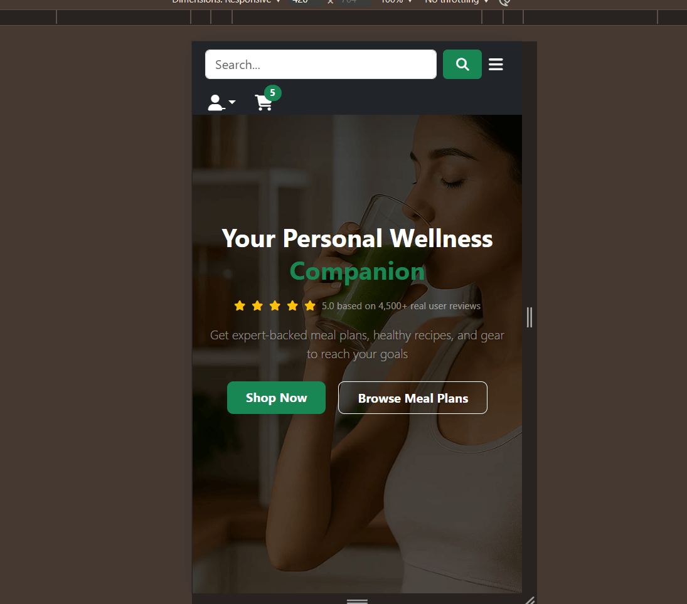


</details>

<details>
   <summary>📸 See recipe-detail page mobile version (Click to expand)</summary>

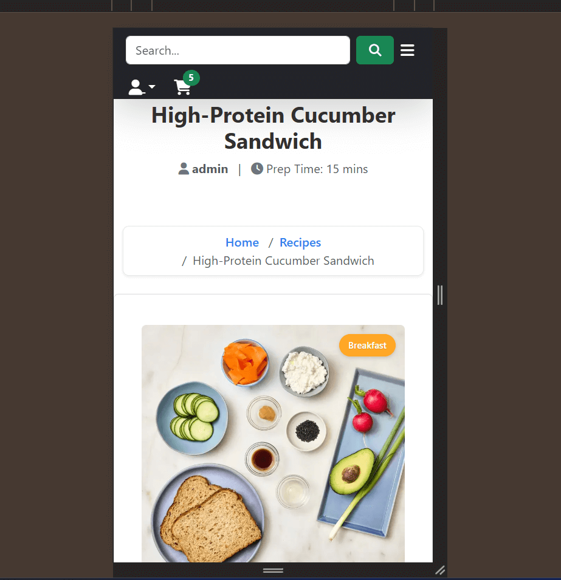

</details>


Accessibility considerations:
- Font size minimums respected (WCAG AA)
- No fixed-width containers that cause horizontal scroll
- Interactive elements spaced for tap accessibility

> FitZone Pro delivers a consistent and intuitive experience on all devices, empowering users to browse, shop, and plan wellness goals from anywhere.


---

###  Wireframes

To plan the structure and user flow of key pages in FitZone Pro, wireframes were created during the design phase. These help visualize layout, UI hierarchy, and user interaction before development.

---

#### 📄 Meal Plan / Recipe Detail Page Wireframe

This wireframe illustrates the layout used for both **meal plan** and **recipe** detail views. It includes:

- Title and main image
- Key info (calories, prep time, servings)
- Ingredients list
- Instructions or meal breakdown
- Save/Start buttons for user interaction

<details>
  <summary>📸 View Recipe wireframe (Click to expand)</summary>


</details>

---

#### 🛍️ Shop Page Wireframe

This wireframe shows the structure of the **shop listing page**, including:

- Search bar
- Product cards with images, price, rating, and description
- Action buttons like “View Product”

<details>
  <summary>📸 View Shop wireframe (Click to expand)</summary>

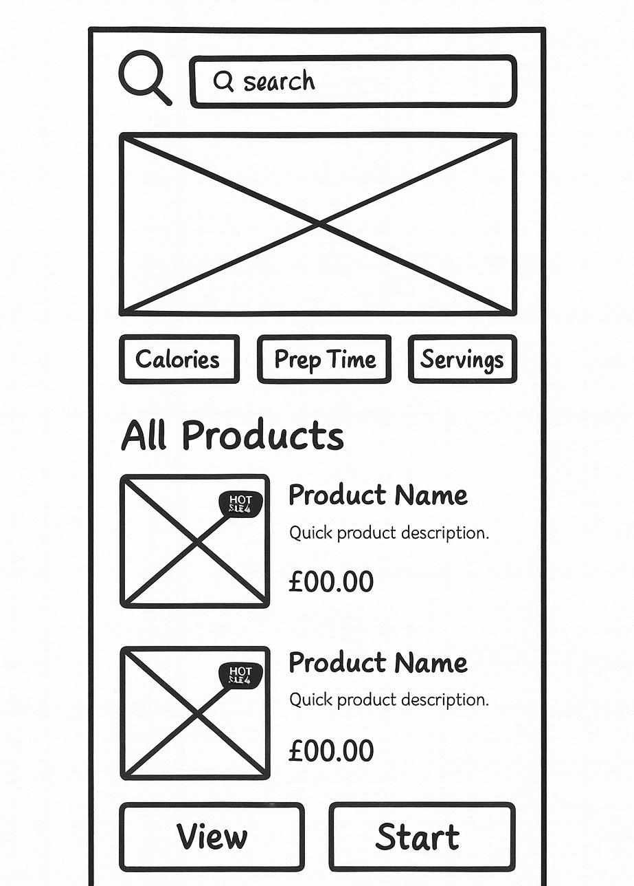

</details>

---

#### 🏠 Homepage Wireframe

This wireframe outlines the main structure of the **FitZone Pro homepage**, designed to introduce the platform and guide users into key sections.

Features include:

- Header with logo, navigation, and cart
- Hero section with CTA (Call to Action)
- Benefits section with 3 quick visual highlights
- Featured products area
- Structured footer for additional navigation

<details>
  <summary>📸 View Homepage wireframe (Click to expand)</summary>

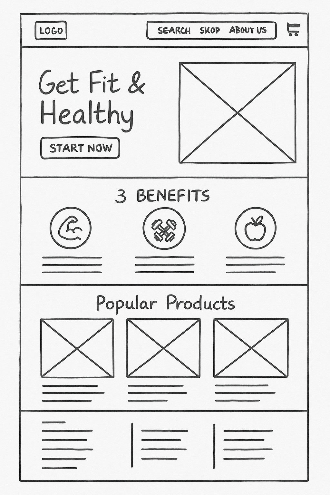

</details>

This design helped establish a clear information hierarchy, guide the visual layout, and ensure responsiveness across screen sizes.


---

> 🛠️ **Note**: While these wireframes provided the initial structure and layout for each page, some elements were refined or adjusted during the development process to improve usability, responsiveness, or match visual design goals. These changes were made iteratively based on user experience considerations and mobile testing. The final implementation stays aligned with the intended purpose of each wireframe while enhancing the overall user interface.


---

## Features

FitZone Pro is a wellness-focused web application that includes personalized dashboards, CRUD features, e-commerce integration, and a modular layout. This section outlines each major feature along with preview images.

---

### Navigation Bar

- Sticky top navigation with dropdowns for Recipes, Meal Plans, Shop, and Profile
- Adapts for mobile with collapsible menu
- Dynamic content: links change based on authentication state (Login/Register vs Dashboard/Logout)
- Includes site logo, search bar, and cart icon with item count

<details>
  <summary>📸 See navbar (Click to expand)</summary>

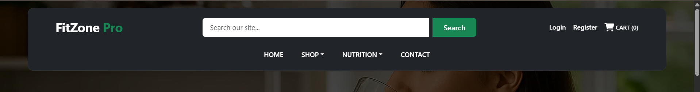

</details>

---

### Homepage

- Hero banner with brand message and call to action
- Sections: Featured Meal Plans, Benefits, Testimonials, and “How It Works”
- Uses gradient backgrounds, icons, and card-based layouts
- Built fully responsive for all screen sizes

<details>
  <summary>📸 See homepage (Click to expand)</summary>

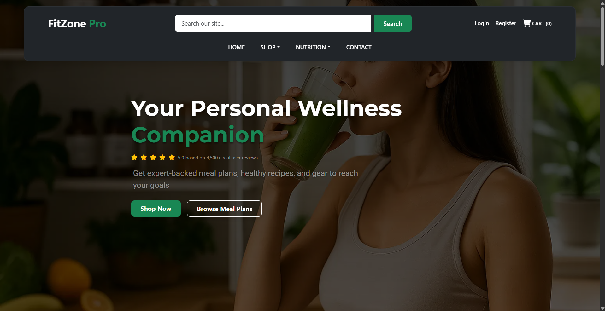

</details>

---

### Authentication (Login / Signup)

The site uses **Django Allauth** to provide secure authentication, including:

Django built-in auth extended with custom login and registration forms
Includes success/error toasts and redirection
Forgot password and change password supported
Secure access to private pages and personalized data

<details>
  <summary>📸 See Login page (Click to expand)</summary>

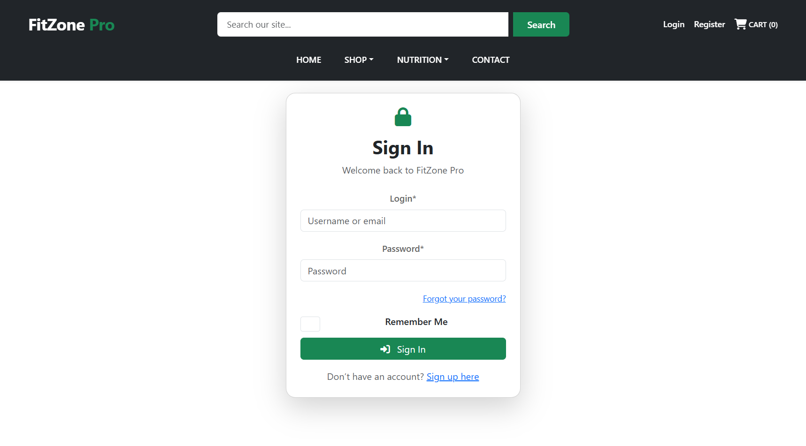

</details>

---

###  Password Reset and Account Recovery

FitZone Pro includes a secure, user-friendly password reset feature using **Django Allauth**. This allows users to recover their accounts if they forget their password, providing a complete authentication and recovery system compliant with distinction-level assessment criteria.

Key features of the reset flow:

- 🛡️ **Secure token-based reset links** generated via Django's built-in system.
- 📩 **Custom email content** delivered via Django’s console backend for development.
- 🧭 Clear and styled feedback pages for:
  - Reset request confirmation
  - New password form
  - Final reset success
- 🧱 All views use custom templates styled to match the rest of the site.
- ✅ Fully integrated with Django Allauth routing (`/accounts/password/reset/` and related views).

#### 📸 Example: Reset Email Output in Development

Below is an example of a reset email generated in development (shown in the terminal/console):

<details>
  <summary>📸 See Password Reset Terminal Output (Click to expand)</summary>

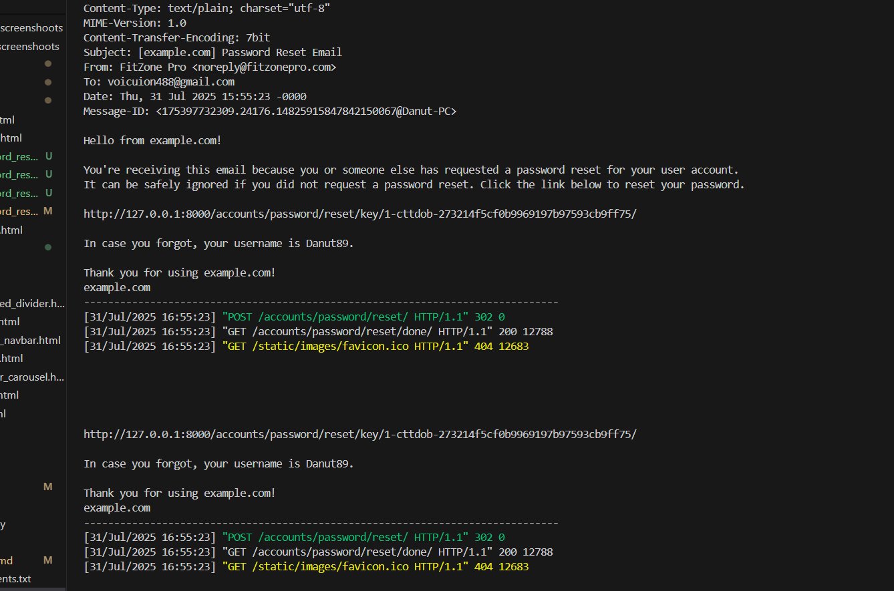

</details>

> 💡 For production, the email backend can be switched to use SMTP with services like Gmail or SendGrid.

---

This implementation meets the following **distinction criteria**:
- Full user control and clear recovery process
- Feedback on all user actions
- Secure handling of credentials and tokens
- Alignment with best UX and defensive design principles

---

### Cart & Checkout

- Cart page shows all added items with quantity and price
- Modify quantities, remove items, or proceed to checkout
- Stripe-powered secure checkout form with delivery info
- On success, order is saved and confirmation is shown

<details>
  <summary>📸 See Cart page (Click to expand)</summary>

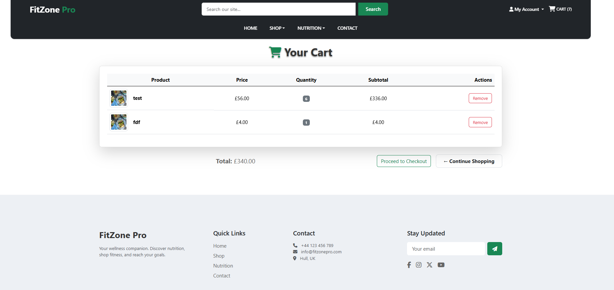

</details>

---

###  Stripe Checkout Integration

FitZone Pro integrates Stripe to provide a **secure and smooth payment experience** during checkout.

Key features:

-  Stripe Elements used for client-side card input — secure, customizable, and PCI-compliant
-  No sensitive card data is stored on our server
-  Stripe public/secret keys are stored securely in environment variables
-  On success, order is saved and a confirmation page is shown
-  Failed payments show error feedback (e.g. invalid card)
-  Tested using Stripe's provided test cards for different scenarios

<details>
  <summary>📸 View Checkout Page (Click to expand)</summary>

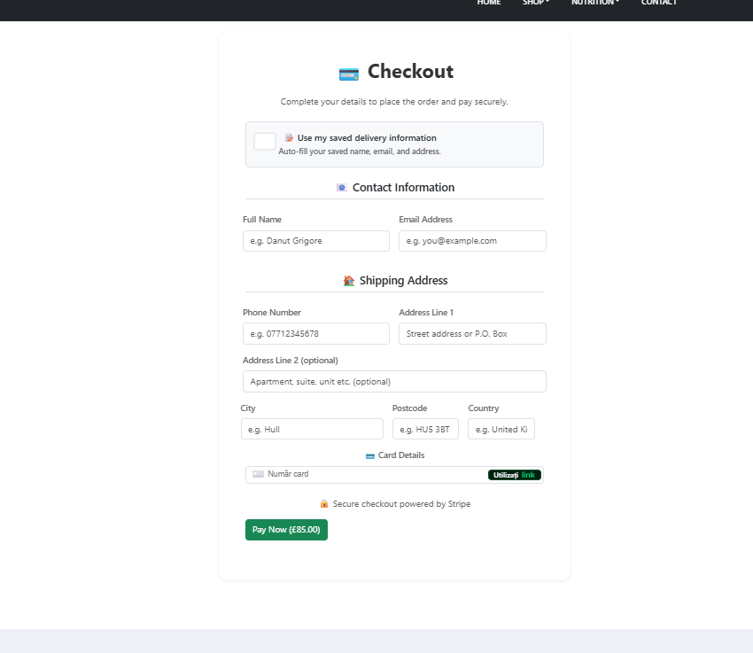

</details>

> 💡 Future updates may include Stripe webhooks for marking orders as "paid" automatically and sending confirmation emails.


####  How to Test the Checkout Process

You can test the shopping and checkout experience using **Stripe’s test mode**, which is active on the deployed version of FitZone Pro.

To simulate a successful payment, use the following test card details provided by Stripe:

| Field            | Value                    |
|------------------|---------------------------|
| Card Number      | `4242 4242 4242 4242`     |
| Expiry Date      | Any future date (e.g. `12/34`) |
| CVC              | Any 3 digits (e.g. `123`) |
| ZIP / Postal Code| Any 5 digits (e.g. `12345`) |

🛒 Steps to test shopping:
1. Add a product to your cart from the Shop page.
2. Proceed to checkout via the cart icon.
3. Fill in the checkout form and use the test card above.
4. After successful payment, you will be redirected to an order confirmation page.
5. Visit the Dashboard to view your saved order.

> 💡 No real money is used — all payments are processed in test mode only.


### Orders & Order History

- All past orders stored and displayed in user dashboard
- Each order includes timestamp, total, and item list
- Admins can view all orders in Django Admin panel

<details>
  <summary>📸 See Order History page (Click to expand)</summary>

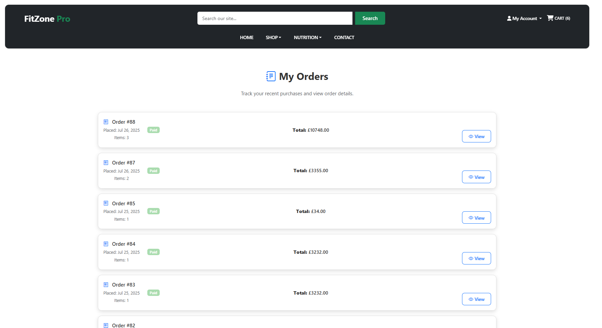

</details>

---

### Recipe CRUD (Create/ Read/ Update/ Delete)

- Recipes can be added, edited, and deleted by logged-in users
- Rich content including image, ingredients, steps, and calories
- Accordion display on detail pages for improved UX
- Recipes can be saved to the wishlist

<details>
   <summary>📸 See Recipe page (Click to expand)</summary>


</details>


---

### Meal Plan Pages

- Browse curated multi-day meal plans
- Each plan shows calories, focus (e.g., Vegan, High-Protein), and duration
- Expandable day-by-day view showing linked recipes
- Save plans to wishlist

<details>
   <summary>📸 See Meal Plan page (Click to expand)</summary>

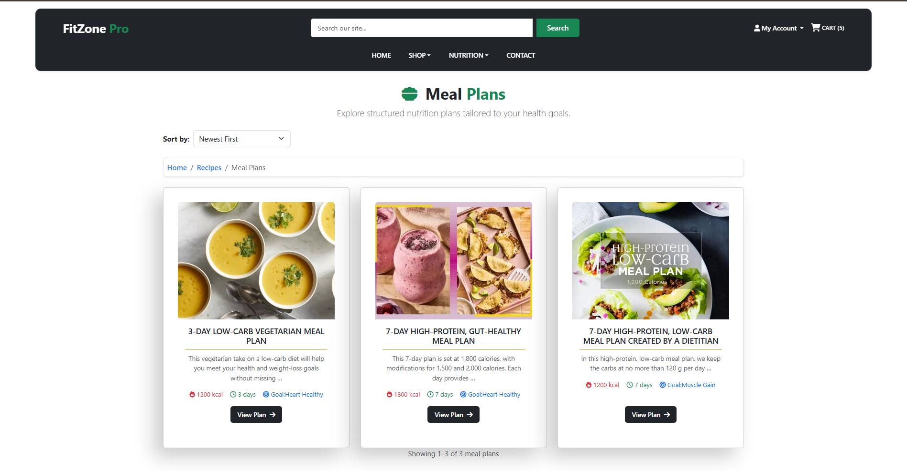

</details>

---

### Product Catalog & Shop

- Browse products by category (Supplements, Equipment, Apparel)
- View product details and add items to cart
- Admins can add/edit/delete products
- Fully responsive product grid

<details>
  <summary>📸 View Shop (Click to expand)</summary>

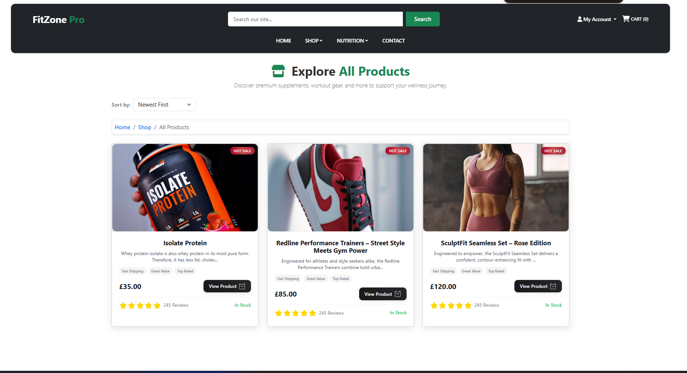

</details>

---

### Wishlist System

- Save any recipe or meal plan with a single button
- Toggle between saved/unsaved state using icon
- View all saved items in dashboard
- Only one entry allowed per item per user (no duplicates)

<details>
  <summary>📸 See Wishlist (Click to expand)</summary>

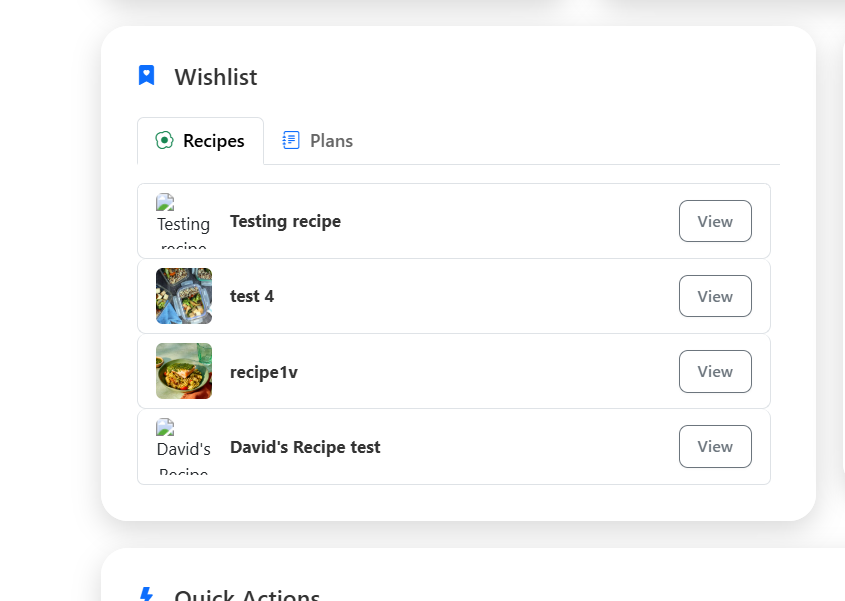

</details>

---

### User Profiles & Dashboard

- Dashboard shows saved items, recent activity, and account links
- Profile page allows updating delivery info and password
- Option to hide/show activity feed
- Personalized and responsive layout

<details>
  <summary>📸 See Dashboard (Click to expand)</summary>

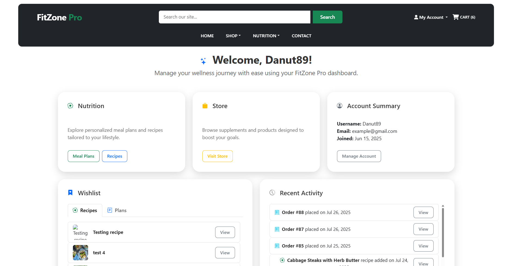

</details>

---

### Profile Settings Page

The Settings page allows logged-in users to manage their account preferences securely and intuitively.

Key Features:
- Edit Personal Information
- Users can update their name, email, and delivery address via a secure form with validation.
- Change Password
= Integrated with Django's built-in password update system, styled using custom forms. Feedback toasts confirm success or error.
- Toggle Recent Activity Feed
- Users can choose to show or hide their dashboard activity log using a single click toggle with color feedback and toast messages.
- FAQ Accordion Section  
- Helpful answers to common user questions about account management, privacy, and checkout. Built using Bootstrap accordion component.

<details>
 <summary>📸 See Settings page (Click to expand)</summary>

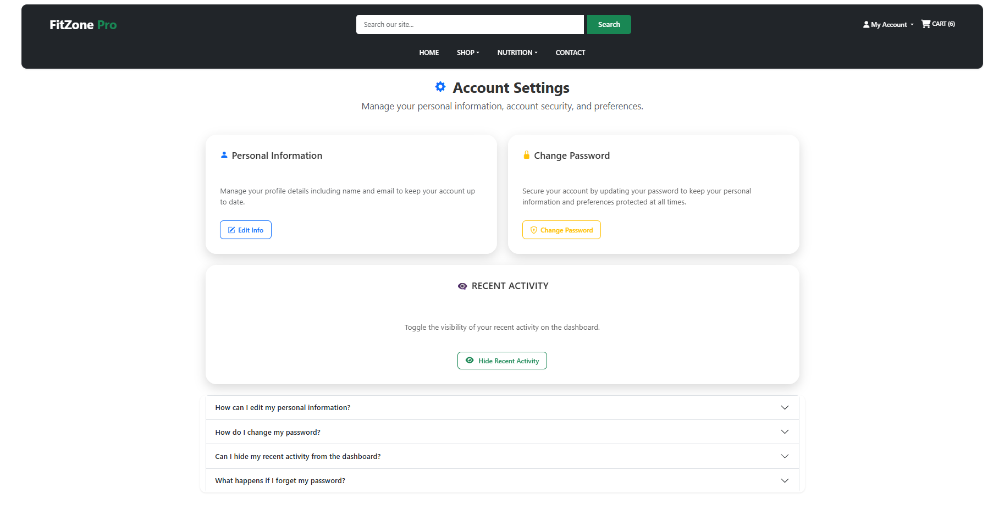

</details>

---

### Contact Page

- Clean contact form with name, email, and message
- Placeholder for optional email functionality
- Can be extended later to integrate with email API

<details>
  <summary>📸 See Contact Form (Click to expand)</summary>

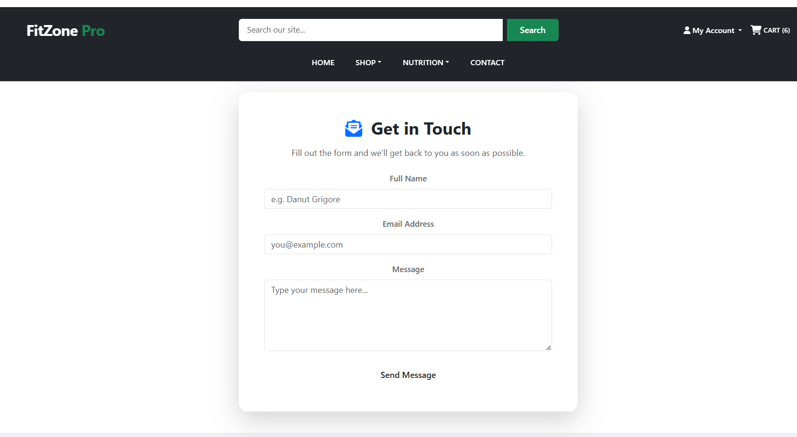


</details>

---

###  Custom Error Pages

FitZone Pro includes custom templates for HTTP error handling, enhancing both **usability** and **branding consistency**. These pages ensure users receive clear, helpful feedback when something goes wrong.

| Error Code | When It Occurs                                         | Template             |
|------------|--------------------------------------------------------|----------------------|
| `404`      | Page not found (invalid URL or deleted resource)       | `errors/404.html`    |
| `403`      | Permission denied (unauthorized access attempt)        | `errors/403.html`    |
| `500`      | Internal server error (uncaught exception in production) | `errors/500.html` |

All pages extend the base layout and maintain consistent styling and navigation.

---

#### 🧪 How to Test Locally (with `DEBUG=False`)

Make sure `DEBUG = False` in your `settings.py` and error handlers are defined:

```python
# urls.py
handler404 = 'home.views.custom_404'
handler403 = 'home.views.custom_403'
handler500 = 'home.views.custom_500'
```

<details>
  <summary>📸 See error page (Click to expand)</summary>

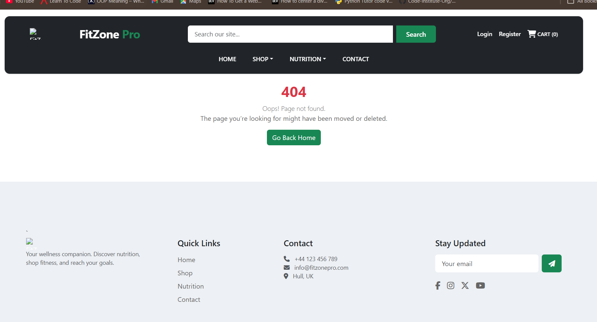


</details>

##  Technologies Used

The FitZone Pro application was built using modern full-stack technologies, combining frontend and backend tools for an interactive, secure, and scalable experience.

---

###  Languages and Frameworks

- **Python 3.11** – Core backend language powering Django and business logic.
- **Django 4.2** – Full-stack MVC framework managing models, views, templates, and admin.
- **PostgreSQL** – Production-ready relational database system, hosted via ElephantSQL.
- **HTML5** – Semantic structure and layout for web pages.
- **CSS3** – Styling with custom themes, responsive design, and media queries.
- **JavaScript (ES6)** – Frontend interactivity, toast logic, and validation.
- **Bootstrap 5** – Utility-first CSS framework used for responsive layout, modals, and grid.

---

###  Libraries and Packages

- **Cloudinary** – Handles media upload and delivery (for user-submitted images).
- **Gunicorn** – WSGI server used in production.
- **dj-database-url** – Parses database URLs from environment variables (for PostgreSQL).
- **psycopg2-binary** – PostgreSQL database adapter for Django.
- **Whitenoise** – Serves static files efficiently in production.
- **Stripe** – Payment gateway used for secure online checkout.
- **crispy-forms** – Enhances Django form styling with Bootstrap integration.
- **django-allauth** – User authentication, registration, and social login handling (if used).
- **boto3 / django-storages** – (Optional, if AWS was used for media or static storage)

---

###  Development Tools

- **Git & GitHub** – Version control and remote repository hosting.
- **GitHub Projects / Issues** – Planning, feature tracking, and progress documentation.
- **Visual Studio Code** – Main IDE for development and debugging.
- **DrawSQL / dbdiagram.io** – ERD creation for model planning and database visualization.
- **Lucidchart / Figma** – Used to plan wireframes and mockups.
- **Heroku or Render** – Cloud deployment and CI/CD integration.
- **Chrome DevTools** – Inspecting frontend layout, performance, and responsiveness.
- **W3C Validators** – Checked code validity (HTML, CSS) for clean, compliant markup.
- **PEP8 / Flake8** – Ensured clean and consistent Python codebase.


> 💡 Many of these tools are also documented throughout the development process in commit messages, planning docs, and this README.

---

##  Code Quality

Maintaining clean, consistent, and maintainable code was a priority throughout the development of FitZone Pro. The project adheres to best practices and standards in both frontend and backend development.

---

### 🧱 Project Structure

- Django’s default project layout was followed and extended with **modular apps**:
  - `nutrition`: recipes, meal plans, and wishlist
  - `shop`: product catalog and categories
  - `cart` / `orders`: e-commerce flow
  - `profiles`: user profile and settings
- Static files (CSS, JS, images) and templates are **organized by app** for scalability and clarity.
- Reusable components (cards, buttons, toasts) are styled via a central CSS system.

---

### 🔤 Naming Conventions & Consistency

- All file and folder names are lowercase and use hyphens or underscores for clarity.
- Models, views, forms, and functions use **descriptive and semantically meaningful names**.
- URL paths and template names are consistent and reflect the feature they belong to.
- HTML classes follow **BEM-style** naming when needed for clarity (e.g. `meal-card__header`).

---

### 📘 Readable & Documented Code

- Inline comments are added for complex logic or less obvious code blocks.
- Each major template, view, and model is preceded by a docstring or section comment.
- Python code conforms to **PEP8** style guide using Flake8 linter.
- HTML and CSS were validated using **W3C validators** with no critical issues remaining.

---

### 🛡️ Defensive Coding & Error Handling

- Input validation is handled at both form and model level using Django’s built-in validators.
- Forms return user-friendly error messages when validation fails.
- Views use `get_object_or_404()` and `try/except` blocks to prevent crashes and handle edge cases.
- Stripe checkout includes error catching and fallback user feedback.

---

### ⚖️ Separation of Concerns

- Views contain business logic only; template logic is kept clean and minimal.
- Templates are built using **Django template inheritance** (`base.html` layout).
- All styles are stored in `index.css`, `nutrition.css`, and `shop.css`, reducing inline clutter.
- JavaScript used only where necessary, in dedicated JS files (e.g. toasts, quantity update).


> 🧠 This clean, readable, and maintainable codebase supports long-term scalability and follows industry standards. Quality is further supported by a consistent Git commit history documenting feature additions, fixes, and testing.

---
## Database

### Application Data Overview

FitZone Pro is a wellness-focused full-stack web application designed around a relational PostgreSQL database. Its structured data supports core functionality such as:

- **Users**: Authentication, profile management, and dashboard preferences.
- **Recipes**: Meal components with ingredients, cooking steps, and metadata.
- **Meal Plans**: Multi-day structures combining recipes for personalized goals.
- **Wishlist**: Save recipes and plans to personal favorites.
- **Products & Categories**: Nutrition and fitness-related goods available for purchase.
- **Orders & Cart Items**: E-commerce features powered by Stripe integration.

All data is normalized and managed through Django ORM. Models are organized into distinct apps reflecting their domain logic (e.g. `nutrition`, `orders`, `profiles`).

---

### Model Relationships

The FitZone Pro backend is built on a normalized PostgreSQL database using Django ORM. The app is split into modular Django apps, each with its own set of models.

The data schema is structured around the following core relationships:

- **User & UserProfile**: A one-to-one link between Django's default `User` model and the extended `UserProfile` model, which stores delivery details and user preferences.
  
- **Meal Plans, Days & Recipes**: 
  - Each `MealPlan` consists of multiple `MealPlanDay` entries (One-to-Many).
  - Each `MealPlanDay` can include multiple `Recipe` objects via a join table `meal_plan_day_recipes` (Many-to-Many).
  
- **Wishlist**:
  - A user can save both `Recipe` and `MealPlan` objects to their `Wishlist`.
  - Each wishlist entry references a `User` and either a `Recipe` or a `MealPlan`.

- **Product & Category**: 
  - Each `Product` belongs to a `Category` (One-to-Many).
  - Products are displayed in the shop and used in both the cart and orders.

- **Cart System**: 
  - A `CartItem` is created when a user adds a product to their cart.
  - Each cart item references a `User` and a `Product`.

- **Orders & OrderItems**:
  - When a user checks out, an `Order` is created.
  - The `Order` contains multiple `OrderItem` objects, each of which references a `Product` and quantity.

These relationships allow for a scalable, real-world structure that supports complex user workflows, including saving meal plans, checking out orders, and customizing the user experience.

---

### Normalization and Integrity

- The schema is **fully normalized** to reduce redundancy and improve scalability.
- All **foreign key** relationships enforce **referential integrity**.
- Where relevant, **cascade delete** and `related_name` attributes are used for clarity.
- Indexed fields such as `user_id`, `date_created`, and `meal_plan_id` optimize filtering and performance.


> 💡 For a visual representation, refer to the [Schema Diagram](#schema-diagram).

---

### Schema Diagram

Below is the full Entity Relationship Diagram (ERD) showing how the models in FitZone Pro are connected. This includes user data, nutrition plans, wishlist system, and order processing:


<details>
  <summary>📸 See ERD (Click to expand)</summary>


</details>

### 🔄 Key Relationships Summary

- **User ↔ UserProfile**: One-to-One  
- **MealPlan → MealPlanDay**: One-to-Many  
- **MealPlanDay ↔ Recipe**: Many-to-Many (through `meal_plan_day_recipes`)  
- **User ↔ Wishlist (↔ Recipe/MealPlan)**: One-to-Many with optional FK  
- **User → Order → OrderItems → Product**: Chain of One-to-Many relationships  
- **Product → Category**: One-to-Many  
- **CartItem**: Combines User + Product to represent active cart

---

### 📊 Table Overview

| Model           | Key Fields                              | Relationships                                      |
|------------------|------------------------------------------|----------------------------------------------------|
| **User**             | id, username, email                     | Links to Profile, Orders, CartItems, Wishlist      |
| **UserProfile**      | user (OneToOne)                         | Extends User with delivery info                    |
| **Recipe**           | id, name, description                   | M2M with MealPlanDay, FK in Wishlist               |
| **MealPlan**         | id, title, summary                      | O2M with MealPlanDay, FK in Wishlist               |
| **MealPlanDay**      | id, meal_plan_id, day_number            | M2M with Recipe via `meal_plan_day_recipes`        |
| **Wishlist**         | user, recipe (opt), meal_plan (opt)     | FK to User + optional FK to Recipe or MealPlan     |
| **Product**          | name, category, price                   | FK to Category, used in OrderItems and CartItems   |
| **Category**         | name                                    | O2M with Product                                   |
| **CartItem**         | user, product, quantity                 | Represents cart items linked to a user             |
| **Order**            | user, total, date_created               | O2M: User → OrderItems                             |
| **OrderItem**        | order, product, quantity                | FK to Product and Order                            |

---

###  Schema Support for Key Features

| Feature                    | Schema Element(s) Involved                  |
|----------------------------|---------------------------------------------|
| Authentication            | User, UserProfile                           |
| Recipe CRUD                | Recipe, User, Wishlist                      |
| Meal Planning              | MealPlan, MealPlanDay, Recipe               |
| Saved Items (Wishlist)     | Wishlist (custom logic for dual-type save) |
| Shop Items & Categories    | Product, Category                           |
| Cart & Checkout            | CartItem, Order, OrderItem                  |
| Dashboard Info             | UserProfile, Order, Wishlist                |

---

##  Testing

Testing was conducted throughout the development of FitZone Pro to ensure functionality, data integrity, responsiveness, and user experience.

A detailed breakdown of all test cases, tools, methods, and results is available in a separate file:

📄 [**View Full Testing Documentation**](TESTING.md)

---

##  Security

Security best practices were followed throughout the development and deployment of FitZone Pro to protect user data, prevent unauthorized access, and ensure secure payment processing.

---

###  User Authentication & Access Control

- Django’s built-in authentication system was used for login, registration, logout, and password management.
- Sensitive user data is only accessible to the authenticated user via session control.
- Profile access, dashboard, and checkout pages are restricted to logged-in users using `@login_required`.
- Admin-only features (like editing products) are protected using `@user_passes_test` and staff checks.
- Superusers have access to Django Admin; regular users do not.

---

###  Input Validation & Form Protection

- All forms include CSRF tokens (Django adds them automatically).
- Django form and model validation is used to prevent invalid data from entering the database.
- Forms return meaningful error messages for users and reject unexpected data types.
- Checkout form and profile update forms include both frontend and backend validation.

---

###  Stripe Payment Security

- Stripe test keys were used during development.
- Card data is **never stored** on the server; it is handled entirely by Stripe's secure JavaScript SDK.
- Only authenticated users can initiate a checkout.
- Payment success and failure are handled via query strings and validated session data.

---

###  Sensitive Data & Environment Variables

- All sensitive keys (e.g., `SECRET_KEY`, `STRIPE_PUBLIC/SECRET_KEYS`, `DATABASE_URL`) are stored in environment variables.
- The `.env` file is **excluded** from version control using `.gitignore`.
- On deployment platforms (e.g., Render), secrets are configured in the dashboard UI.

---

###  General Deployment Practices

- `DEBUG = False` in production settings
- `ALLOWED_HOSTS` explicitly set
- Static files are served using **WhiteNoise** (production-ready)
- Admin URL kept default unless otherwise protected (optional to change to a non-standard URL)
- All outgoing dependencies are listed in `requirements.txt`


> 🔐 FitZone Pro follows Django’s security model and industry standards for authentication, validation, and secret management.

---

##  Deployment

FitZone Pro is deployed to [Render](https://render.com/) — a cloud-based hosting platform suitable for full-stack Django applications.

All production configurations, environment variables, and build steps are handled via Render's dashboard.

---

###  Render Deployment Setup

The live application is accessible at:  
🔗 [https://fitzone-pro.onrender.com](https://milestone-project-4.onrender.com) *(update if needed)*

---

### ⚙️ Key Configuration Details

- **Database**: PostgreSQL (via Render’s internal PostgreSQL add-on)
- **Static Files**: Served via WhiteNoise
- **WSGI Server**: Gunicorn
- **Environment Variables**:
  - `SECRET_KEY`, `DEBUG`, `DATABASE_URL`, `STRIPE_PUBLIC_KEY`, `STRIPE_SECRET_KEY`, etc.
- **Deployment Tools**:
  - `build.sh` script or Render build commands
  - `requirements.txt` for Python dependencies
  - `Procfile` defines the WSGI entry point

---

###  Deployment Process

1. Create new web service in Render and connect to GitHub repo
2. Add required **environment variables**
3. Define:
   - **Start command**: `gunicorn fitzone_pro.wsgi:application`
   - **Build command** (if using `build.sh`): `./build.sh`
4. Add PostgreSQL database via Render’s service panel
5. Wait for automatic build + deploy (on every commit)

---

###  Cloning and Running Locally

To run FitZone Pro locally:

1. Clone the repository:

```bash
git clone https://github.com/your-username/fitzone-pro.git
cd fitzone-pro
```

 ##  Future Improvements

While FitZone Pro is fully functional and tested, several enhancements are planned for future iterations to enrich the user experience and improve scalability:

---

### 🔄 Functional Enhancements

- **Email Notifications**  
  - Send order confirmation emails after Stripe checkout using `sendgrid` or Django email backend.

- **User Activity Log**  
  - Track all CRUD activity in the user dashboard and allow users to export a summary.

- **Recipe Ratings and Reviews**  
  - Let users rate and review recipes to increase engagement and feedback.

- **Comments on Meal Plans**  
  - Introduce a comment/discussion section on meal plan detail pages.

---

###  UX & UI Enhancements

- **Dark Mode Toggle**  
  - Allow users to switch between light and dark themes.

- **Animations & Transitions**  
  - Enhance feedback with subtle transitions for buttons, toast messages, and page loads.

---

### 💻 Admin Features

- **Approve Recipes Before Publication**  
  - Introduce moderation tools for user-submitted recipes.

- **Analytics Dashboard**  
  - View site metrics (number of recipes, popular products, checkout conversion rate).


> ✨ These improvements are based on user feedback, testing insights, and scalability goals.

---

## Credits

This section acknowledges all resources, tools, tutorials, and individuals that contributed to the development of FitZone Pro.

---

###  Resources and Tutorials

- [Code Institute](https://codeinstitute.net/) — Full Stack Web Development curriculum and project rubric  
- [Django Documentation](https://docs.djangoproject.com/en/stable/) — Backend framework reference  
- [Bootstrap 5 Docs](https://getbootstrap.com/docs/5.3/) — CSS and grid layout utilities  
- [Stripe Docs](https://stripe.com/docs) — Secure payment integration guidance  
- [Flake8](https://flake8.pycqa.org/) — Python code linter for style and quality  
- [dbdiagram.io](https://dbdiagram.io/) — Created the ERD (Entity Relationship Diagram)  
- [Figma](https://www.figma.com/) — Wireframing and visual planning  
- [Font Awesome](https://fontawesome.com/) — Icon set for UI clarity and interaction  
- [Bootstrap Icons](https://icons.getbootstrap.com/) — Additional inline icon set  
- [W3C Validators](https://validator.w3.org/) — HTML validation  
- [Jigsaw CSS Validator](https://jigsaw.w3.org/css-validator/) — CSS syntax validation  
- [GitHub Markdown Guide](https://www.markdownguide.org/basic-syntax/) — For formatting the README and Testing files  
- [EatingWell](https://www.eatingwell.com/) — Inspiration and guidance for recipes and meal plan data structure  
- [Unsplash](https://unsplash.com/) — Free, high-quality images for product and page visuals  
- [Pexels](https://www.pexels.com/) — Free image source used in shop/product cards  
- [WAVE Accessibility Tool](https://wave.webaim.org/) — Automated accessibility checker used during testing  
- [AOS.js](https://michalsnik.github.io/aos/) — Animate on Scroll library for homepage transitions  
- [Placehold.co](https://placehold.co/) — Used temporarily to create placeholder images during development
- [CSS Cards](https://freefrontend.com/css-cards/#google_vignette) — Inspiration for products,  recipes and meal plan cards


---

###  Inspiration and Acknowledgements

- 💻 **My mentor and Code Institute tutors** — for feedback, guidance, and support throughout the project  
- 🧠 **Code Institute Slack community** — for sharing insights, troubleshooting, and motivation  
- 🔧 **Figma Community Mockups** — used during wireframing and section layout planning  
- 📣 **Users who tested the project** — for valuable UX feedback and improvement ideas  
- 👨‍👩‍👧‍👦 **My family** — for encouraging me to push through the long hours and learning curve

> ❤️ This project is a result of months of learning, iteration, testing, and dedication. Thank you to everyone who helped shape it.

