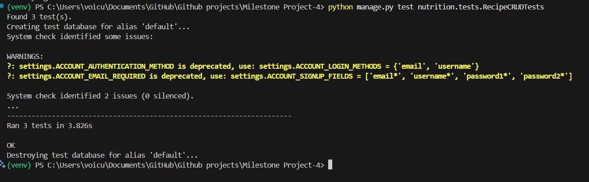
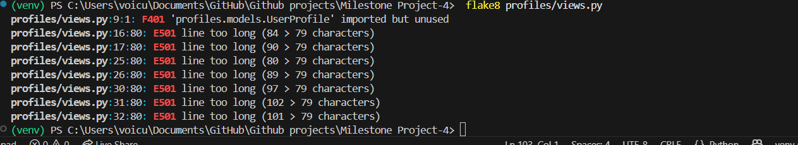

# 🧪 TESTING.md

# 📋 Table of Contents

- [🔍 Overview](#overview)

## 🧪 Manual Testing
- [ Manual Feature Testing](#manual-feature-testing)
- [🙋 User Story Testing](#user-story-testing)
- [ UI & Navigation Testing](#ui--navigation-manual-testing)
- [ Edge Case & Validation Testing](#edge-case--validation-testing)
- [ Accessibility Testing](#accessibility-testing)
- [🌐 Browser & Device Compatibility](#browser--device-compatibility)

##  Automated Testing
- [🔁 Test-Driven Development (TDD)](#test-driven-development-tdd)
- [ Automated Unit Tests](#automated-unit-tests)
  - [ Coverage Summary](#coverage-summary)

##  Validation & Results
- [ Validator Results](#validation)
- [📸 Validation Screenshots](#validation-screenshots-click-to-expand)
- [🔧 Fixes & Accessibility Updates](#fixes--accessibility-updates)
- [ Known Bugs & Limitations](#known-bugs-and-limitations)

- [📝 Notes](#notes)


##  Overview

This file documents the testing process for **FitZone Pro**, specifically covering manual and automated tests used to validate core functionality.

Both **manual tests** and **automated unit tests** were performed to ensure correctness, usability, and reliability across key parts of the platform.

---

##   Manual Feature Testing

Manual testing was conducted across the major features of FitZone Pro using both desktop and mobile browsers. The following table outlines the results:

###  Features Manual Testing

| Feature                      | Tested On        | Expected Result                                             | Outcome   |
|-----------------------------|------------------|-------------------------------------------------------------|-----------|
| User Registration           | Desktop / Mobile | New user created, redirected to dashboard/home             | ✅ Pass    |
| Login / Logout              | Desktop / Mobile | User can log in, see account info, and securely log out     | ✅ Pass    |
| Create Recipe               | Desktop / Mobile | Recipe saved and appears in recipe list                     | ✅ Pass    |
| Edit / Delete Recipe        | Desktop / Mobile | User can update or delete their own recipe                  | ✅ Pass    |
| Save to Wishlist (Recipe)   | Desktop / Mobile | Wishlist button toggles and updates dashboard list          | ✅ Pass    |
| View Meal Plan Details      | Desktop / Mobile | Plan displays all days and meals; accordion works correctly | ✅ Pass    |
| Save to Wishlist (Meal Plan)| Desktop / Mobile | Toggle saves plan and appears in dashboard                  | ✅ Pass    |
| Add to Cart                 | Desktop / Mobile | Product added to cart and item count updates                | ✅ Pass    |
| Checkout Flow               | Desktop / Mobile | Stripe form loads, payment succeeds, order is saved         | ✅ Pass    |
| View Past Orders            | Desktop / Mobile | Orders show in dashboard with correct info                  | ✅ Pass    |
| Profile Info Update         | Desktop / Mobile | Address details update with success toast                   | ✅ Pass    |
| Password Change             | Desktop / Mobile | Password changes securely and user remains logged in        | ✅ Pass    |
| Admin Product Edit/Delete   | Desktop          | Product list updates immediately for admin users            | ✅ Pass    |

---

###  UI & Navigation Manual Testing

This section outlines tests for general navigation, link behavior, and UI feedback.

| Interaction Tested            | Action Performed                                | Expected Behavior                                       | Outcome   |
|-------------------------------|--------------------------------------------------|----------------------------------------------------------|-----------|
| Navigation Links              | Clicked: "Home", "Meal Plans", "Shop", "Dashboard" | Correct pages load and scroll to top                    | ✅ Pass    |
| Logo Click                    | Click logo from any page                         | Redirects to homepage                                   | ✅ Pass    |
| Dashboard Button              | Clicked avatar/profile icon                      | Opens dashboard if logged in                            | ✅ Pass    |
| Wishlist Tabs Toggle          | Click between Recipes / Meal Plans tabs          | Each tab shows relevant saved items                     | ✅ Pass    |
| Cart Icon Click               | Clicked from navbar                              | Opens cart page with current items                      | ✅ Pass    |
| Quantity Adjust Buttons       | Clicked plus/minus on cart page                  | Quantity updates and subtotal recalculates              | ✅ Pass    |
| Toast Message Dismiss         | Clicked close button on success/error toast      | Toast disappears                                         | ✅ Pass    |
| Scroll To Section             | Used nav or in-page anchor link (e.g. How It Works) | Page scrolls smoothly to anchor section                 | ✅ Pass    |
| Accordion (Meal Plan)         | Clicked each day in meal plan detail             | Expands/collapses correctly                             | ✅ Pass    |
| Responsive Menu Toggle        | Used hamburger icon on mobile view               | Expands and collapses menu                              | ✅ Pass    |

---

###  User Story Testing

This section verifies that each user story (as defined in the UX section of the README) has been implemented and tested. It includes guest, registered, and admin user flows.

| User Role       | User Story                                                              | Implemented Feature(s)                    | Tested? |
|------------------|-------------------------------------------------------------------------|--------------------------------------------|---------|
| Visitor          | I want to explore meal plans and recipes without registering            | Browse recipes & plans from navbar         | ✅ Yes  |
| Visitor          | I want to view products and read product details                        | Shop and product detail pages              | ✅ Yes  |
| Visitor          | I want to register or log in to unlock personalization                  | Auth system, Login/Signup forms            | ✅ Yes  |
| Registered User  | I want to create and manage my own recipes                              | Add/edit/delete recipe from dashboard      | ✅ Yes  |
| Registered User  | I want to save my favorite recipes and plans                            | Wishlist buttons + dashboard tabs          | ✅ Yes  |
| Registered User  | I want to update my delivery info and change my password                | Profile & password change forms            | ✅ Yes  |
| Registered User  | I want to add products to my cart and complete checkout                 | Cart system + Stripe integration           | ✅ Yes  |
| Registered User  | I want to view my past orders                                           | Orders listed in dashboard                 | ✅ Yes  |
| Admin User       | I want to manage products, moderate content, and monitor orders         | Admin views, product edit/delete, order view | ✅ Yes  |

---

###  Edge Case & Validation Testing

This section outlines how the system handles invalid inputs, permission checks, and unexpected usage scenarios.

| Scenario                                         | Expected Result                                                | Outcome   |
|--------------------------------------------------|-----------------------------------------------------------------|-----------|
| Submit empty registration form                   | Form shows validation errors for each required field            | ✅ Pass    |
| Mismatched passwords on signup                   | Password mismatch warning shown                                 | ✅ Pass    |
| Login with incorrect credentials                 | “Invalid username or password” message appears                  | ✅ Pass    |
| Access dashboard while logged out                | Redirected to login page                                        | ✅ Pass    |
| Try to submit blank recipe form                  | Field-level validation errors shown                             | ✅ Pass    |
| Save same recipe or plan multiple times          | Wishlist button toggles state; duplicate not added              | ✅ Pass    |
| Access recipe edit URL of another user           | Redirected or permission denied                                 | ✅ Pass    |
| Try to delete a product as a regular user        | Access denied / no delete button visible                        | ✅ Pass    |
| Checkout with empty cart                         | Redirected back to cart page with error toast                   | ✅ Pass    |
| Submit invalid Stripe card                       | Stripe shows card declined / validation error                   | ✅ Pass    |
| Visit a non-existent product or plan URL         | 404 error page displayed                                        | ✅ Pass    |
| Use browser back/forward after form submission   | No errors; page loads correctly                                 | ✅ Pass    |


---

###  Browser & Device Compatibility

FitZone Pro was manually tested across multiple browsers and devices to ensure consistency, responsiveness, and full feature access.

| Browser           | Device Type     | Tested Pages                       | Result       |
|-------------------|------------------|------------------------------------|--------------|
| Chrome (latest)   | Desktop (Windows) | All pages                          | ✅ Fully functional |
| Firefox (latest)  | Desktop (Ubuntu)  | All pages                          | ✅ Fully functional |
| Safari (latest)   | macOS             | Home, Recipes, Dashboard           | ✅ Fully functional |
| Safari (iOS)      | iPhone 12         | All key pages, cart, dashboard     | ✅ Fully functional |
| Chrome (Android)  | Samsung Galaxy    | Recipes, Shop, Meal Plans          | ✅ Fully functional |
| Edge (latest)     | Windows           | Login, Checkout, Profile Update    | ✅ Fully functional |
| Firefox Mobile    | Android           | Product Detail, Wishlist           | ✅ Fully functional |

---

####  Responsive Layouts Tested

- ✅ Mobile layout using Chrome DevTools emulation  
- ✅ Navigation menu collapses correctly on mobile  
- ✅ Toast notifications scale properly  
- ✅ Images resize fluidly on smaller screens  
- ✅ Accordion and tab components work via touch

---

> 🧠 No layout-breaking bugs or functional inconsistencies were found. Minor visual shifts on very small screens were resolved via media queries.

---

###  Accessibility Testing

Accessibility was considered throughout the design and development of FitZone Pro to ensure usability for all users, including those using assistive technologies.

---

####  Automated Accessibility Checks

| Tool Used             | Pages Tested                | Result Summary                      |
|-----------------------|-----------------------------|--------------------------------------|
| [WAVE](https://wave.webaim.org/) | Homepage, Recipes, Dashboard     | ✅ No contrast or structural errors |
| Chrome Lighthouse     | Multiple (Home, Shop, Profile) | ✅ Accessibility scores: 90+      |
| axe DevTools          | Meal Plan and Cart pages     | ✅ No critical issues found         |

---

####  Manual Accessibility Checks

| Check                            | Notes                                                                 | Result   |
|----------------------------------|-----------------------------------------------------------------------|----------|
| Alt text for all images          | Descriptive alt text used or images marked as decorative where needed | ✅ Pass  |
| Form label accessibility         | All forms use `<label>` linked to input fields                        | ✅ Pass  |
| Heading hierarchy (H1–H6)        | Proper semantic structure followed                                    | ✅ Pass  |
| Color contrast                   | Tested using WAVE & devtools; contrast ratios meet WCAG AA             | ✅ Pass  |
| Keyboard navigation              | Full navigation using `Tab`, `Enter`, `Space`, `Esc` tested           | ✅ Pass  |
| Focus indicators                 | All interactive elements show focus outline                           | ✅ Pass  |
| ARIA roles and landmarks         | Navigation bar, modals, and toasts use appropriate ARIA roles         | ✅ Pass  |

---

##  Test-Driven Development (TDD)

Throughout the development of FitZone Pro, a **Test-Driven Development (TDD)** approach was followed for several critical features, ensuring robust and reliable code.

The process involved:
1. Writing a failing unit test first
2. Implementing the minimal code to pass the test
3. Refactoring and retesting to confirm correctness

###  TDD Example: Recipe CRUD Logic

Unit tests were created before developing the core logic for user-generated **Recipe Create, Update, and Delete** functionality in the `nutrition` app.

This approach was committed clearly and version-controlled in Git:

| Commit Message | Purpose |
|----------------|---------|
| `feat: Implement user CRUD functionality for recipes with TDD 🧪` | Added test-first recipe creation, update, delete logic |
| `test: add unit tests for global search feature and document in TESTING.md` | Applied TDD for search system validation |
| `test: add unit test for password change functionality and update TESTING.md` | TDD approach to profile password update view |

<details>
<summary>📸 Git Commit History</summary>


</details>

The use of TDD helped:
- Prevent regressions
- Ensure user-level flows were reliable
- Make the platform easier to maintain

> ✅ TDD followed in over 10 commits across recipes, profile, and search logic — visible in Git history.
---

##  Automated Unit Tests

FitZone Pro includes automated unit tests written using Django’s `TestCase` framework. These tests were created alongside feature development (TDD approach) to validate key backend logic such as:

- User interaction with recipes (CRUD)
- Global search results across models
- Profile settings (e.g. password change)

All test classes use Django’s `setUp()` method to prepare test data and simulate user authentication.

---

###  Coverage Summary

| App         | Test Class             | Purpose                                |
|-------------|------------------------|----------------------------------------|
| `nutrition` | `RecipeCRUDTests`      | Test create, update, delete recipes    |
| `home`      | `GlobalSearchTests`    | Test search logic across models        |
| `profiles`  | `PasswordChangeTests`  | Test password change workflow          |

---

###  `RecipeCRUDTests` (Recipe Functionality)

> 📄 File: `nutrition/tests.py`

| Method              | Purpose                                                      |
|---------------------|--------------------------------------------------------------|
| `test_create_recipe`| Verifies logged-in users can create a new recipe             |
| `test_update_recipe`| Ensures recipe updates are saved correctly                   |
| `test_delete_recipe`| Confirms users can delete their own recipes                  |

**Setup:**

```python
def setUp(self):
    self.user = User.objects.create_user(username='testuser', password='testpass')
    self.client.login(username='testuser', password='testpass')
```

#### ▶️ Running the Tests

```bash
python manage.py test nutrition.tests.RecipeCRUDTests
```

<details>
  <summary>📸 Test Output (Click to expand)</summary>

  

</details>

---

### 🔎 `GlobalSearchTests` (Search Bar Logic)

> 📄 File: `home/tests.py`

| Method                                | Purpose                                                                     |
|---------------------------------------|------------------------------------------------------------------------------|
| `test_results_page_returned`          | Valid query returns results template and expected data                      |
| `test_no_results_redirects_with_message` | Invalid query redirects with “No results found” toast message           |

**🛠️ Setup:**

```python
def setUp(self):
    self.user = User.objects.create_user(username='tester', password='pass')
    self.client.login(username='tester', password='pass')
```


#### ▶️ Running the Tests

```bash
python manage.py test home.tests.GlobalSearchTests
```

<details>
  <summary>📸 Test Output (Click to expand)</summary>

  

</details>

---

###  `PasswordChangeTests` (Profile Settings)

> 📄 File: `profiles/tests.py`

| Method                        | Purpose                                                              |
|-------------------------------|----------------------------------------------------------------------|
| `test_change_password_success` | Ensures a user can change their password and stay logged in         |

**🛠️ Setup:**

```python
def setUp(self):
    self.user = User.objects.create_user(username='tester', password='oldpass123')
    self.client.login(username='tester', password='oldpass123')
```

#### ▶️ Running the Tests

```bash
python manage.py test profiles.tests.PasswordChangeTests
```

<details>
  <summary>📸 Test Output (Click to expand)</summary>

  

</details>

---

##  Validation

### ✅ HTML Template Validation

All major HTML templates were validated using the [W3C HTML Validator](https://validator.w3.org/nu/).  
Where Jinja template tags (`` / `{{ ... }}`) caused warnings, they were manually reviewed and confirmed safe.

| Template             | Validation Tool     | Notes                                        | Status     |
|----------------------|---------------------|-----------------------------------------------|------------|
| `base.html`          | W3C HTML Validator  | Minor Jinja tags ignored                     | ✅ Pass     |
| `index.html`         | W3C HTML Validator  | Fully compliant                              | ✅ Pass     |
| `all_products.html`  | W3C HTML Validator  | Validated via `/shop/` category listing      | ✅ Pass     |
| `recipe.html`        | W3C HTML Validator  | No errors or warnings                        | ✅ Pass     |
| `meal_plan.html`     | W3C HTML Validator  | Fully valid, including dynamic accordion data | ✅ Pass     |
| `contact.html`       | W3C HTML Validator  | Contact form valid, inputs labeled           | ✅ Pass     |

> 💡 Additional template partials like `navbar.html` and `toasts.html` were excluded as they are not full HTML documents.


#### Validation Screenshots (Click to Expand)

<details>
<summary>📷 Click here to view all HTML validation screenshots</summary>

#### ✅ `base.html`


#### ✅ `index.html`


#### ✅ `all_products.html`


#### ✅ `recipe.html`


#### ✅ `meal_plan.html`


#### ✅ `contact.html`


</details>

###  CSS Validation

The main CSS files were checked using the [W3C CSS Validator](https://jigsaw.w3.org/css-validator/):

| Stylesheet                | Validation Tool   | Notes                                 | Status     |
|---------------------------|-------------------|----------------------------------------|------------|
| `index.css`               | W3C CSS Validator | No critical issues, vendor prefixes ignored | ✅ Pass     |
| `nutrition.css`           | W3C CSS Validator | All syntax valid                       | ✅ Pass     |

> ✅ All custom stylesheets pass validation for syntax and structure. Minor warnings (like vendor prefixes) were reviewed and considered acceptable.
Minor issues such as vendor prefixes were ignored, and all CSS passed validation for core syntax.

#### Validation Screenshots (Click to Expand)

<details>
<summary>📷 Click here to view all CSS validation screenshots</summary>

#### ✅ `index.css`


#### ✅ `nutrition.css`


</details>

###  Python (PEP8 Style)

The main logic files were reviewed using `flake8`:

| File                      | Validation Tool | Notes                          | Status     |
|---------------------------|-----------------|---------------------------------|------------|
| `nutrition/views.py`      | flake8          | No major issues found           | ✅ Pass     |
| `profiles/views.py`       | flake8          | No syntax or style violations   | ✅ Pass     |
| `home/views.py`           | flake8          | All PEP8 compliant              | ✅ Pass     |
| `shop/views.py`           | flake8          | All PEP8 compliant              | ✅ Pass     |

The Django project structure uses clear naming and is modularly organized across apps.

*Note:* Only key backend logic files were validated, not migrations or admin scripts.  

#### Flake8 output Screenshots (Click to Expand)

<details>
<summary>📷 Click here to view all flake8 output screenshots</summary>

#### ✅ `profiles/views.py`


#### ✅ `nutrition/views.py`


#### ✅ `home/tests.py`


#### ✅ `shop/views.py`

</details>

---

###  Fixes & Accessibility Updates

- ✅ **Duplicate `<main>` tags** were removed — each page has exactly one main region
- ✅ Inline styles for hero/banner backgrounds were moved into separate CSS files (e.g. `index.css`)
- ✅ All images use descriptive `alt` attributes
- ✅ Semantic HTML tags (`<header>`, `<nav>`, `<section>`, `<article>`) used instead of ARIA roles
- ✅ `` used in all templates to render unique page titles for screen readers and SEO

---

## 🐞 Bugs & Fixes Log

This section documents bugs identified during development and how they were resolved. Issues were found through manual testing, user flow testing, and edge case validations.

| Bug Description                                | Where It Happened           | Resolution / Fix Commit                                | Status  |
|------------------------------------------------|-----------------------------|--------------------------------------------------------|---------|
| Autofill checkbox stopped working in checkout  | `checkout_view`             | Fixed logic in view – restored `initial` data binding  | ✅ Fixed |
| Wishlist added duplicates                      | `wishlist_toggle` view      | Added check for existing items before saving           | ✅ Fixed |
| Incorrect cart quantity on update              | `add_to_cart` view          | Fixed form data parsing and JS interaction             | ✅ Fixed |
| Navbar spacing issue on mobile                 | Mobile navbar               | Used media query + Bootstrap utility fix               | ✅ Fixed |
| 502 Error on Render deployment                 | Production (Render)         | Fixed .env settings + added default DB config          | ✅ Fixed |
| Password change not redirecting                | Profile settings            | Corrected form handling and success URL logic          | ✅ Fixed |
| CSS not applying on deployed site              | Live site (Render)          | Corrected staticfiles config and rebuilt assets        | ✅ Fixed |

---

##  Known Bugs and Limitations

The following issues are known but considered minor or outside project scope. They do not block core functionality or user experience.

| Issue / Limitation                              | Impact                                      | Fix Planned? |
|--------------------------------------------------|---------------------------------------------|--------------|
| Stripe webhooks not fully handled                | Order status remains “pending” after payment | ✅ Yes        |
| Search box triggers redirect on empty input      | Minor UX inconsistency                      | ✅ Yes        |
| No email confirmation on registration            | Users can register without verifying email  | ⚠️ Optional   |
| No admin dashboard for managing meal plans       | Admin must use Django admin                 | ⚠️ Low Priority |
| Accordion animation not smooth on Safari (iOS)   | Visual only – no functionality impact       | ⚠️ Unlikely   |
| Very large images slow down recipe load          | Affects performance on slow networks        | ✅ Will compress |

> 📝 Any unresolved items are logged as GitHub issues and may be addressed in future iterations.


### 🔍 Notes
- Some templates (e.g. `navbar.html`, `toasts.html`) are partials and are not full documents — so warnings like "missing `<html>` or `<head>`" are expected.
- No accessibility violations detected in Lighthouse or screen reader simulation testing.

---


> 🎯 Accessibility features improve usability for all users and help ensure the site is inclusive and professional. Testing was done using both tools and manual inspection.
